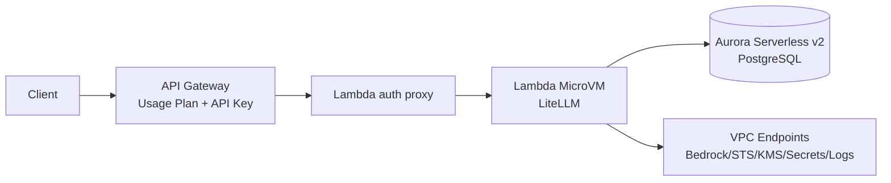
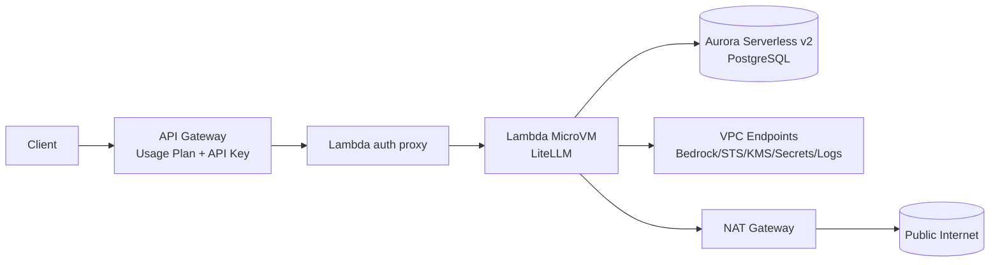
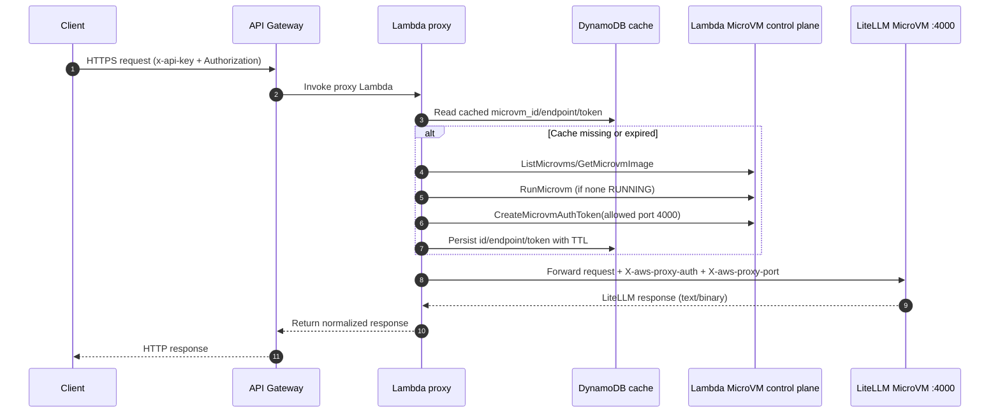

# LiteLLM AWS Lambda MicroVM Serverless

AWS-only deployment of LiteLLM on Lambda MicroVM with Aurora Serverless v2, API Gateway, and CDK.

## Architecture

`Client -> API Gateway (usage plan + API key) -> Lambda proxy -> Lambda MicroVM (LiteLLM) -> Aurora + Bedrock`

### Mode 1: `publicMicrovm=true` (default, no NAT)



### Mode 2: `publicMicrovm=false` (private mode with NAT)



Key design choices:

- `publicMicrovm=true` (default): MicroVM connector subnets are public, NAT = `0`, DB remains private.
- Aurora is always in isolated private DB subnets.
- Runtime MicroVM egress uses a VPC connector so LiteLLM can always reach Aurora.
- Private AWS service access is through VPC endpoints (Bedrock, STS, KMS, Secrets Manager, CloudWatch Logs, S3 gateway).

## What this stack creates

- VPC and subnets:
  - `publicMicrovm=true`: `AppPublic` + `DbPrivate`
  - `publicMicrovm=false`: `AppPublic` + `AppPrivate` + `DbPrivate` (includes NAT)
- Aurora PostgreSQL Serverless v2 (`min ACU 0`, `max ACU 2`)
- Lambda MicroVM image resource (`AWS::Lambda::MicrovmImage`) and runtime settings
- API Gateway REST API with:
  - required API key (`x-api-key`)
  - binary media types enabled (`*/*`)
  - public and admin usage plans
- Lambda proxy that:
  - auto-discovers/starts MicroVM
  - creates MicroVM auth token
  - injects `X-aws-proxy-auth` and `X-aws-proxy-port`
  - preserves text/binary responses correctly
- Secrets Manager secrets for:
  - API Gateway key (`AwsGatewayApiKeySecretArn`)
  - LiteLLM master key parts (`LiteLlmMasterKeySecretArn`, `prefix + suffix`)
- DynamoDB TTL cache table for MicroVM/token proxy state
- ECR + CodeBuild project for ARM64 LiteLLM base image mirroring

## Operational findings (important)

- **No NAT in default mode:** `publicMicrovm=true` sets `natGateways: 0`.
- **DB is private while MicroVM can be public subnet-attached:** supported in this stack.
- **Proxy concurrency bottleneck fixed:** reserved concurrency is `50` (was too low for UI asset fan-out).
- **API throttling tuned:** public and admin usage plans have higher burst/rate for practical use.
- **Static assets stability:** API Gateway binary media types + proxy binary-safe forwarding avoid UI asset corruption/500s.
- **Auth bug fixed in key script:** `/key/generate` now sends real Bearer master key in `Authorization`.
- **Missing IAM fixed:** proxy role includes `lambda:GetMicrovmImage` and `lambda:TerminateMicrovm`.
- **Log retention standardized:** MicroVM runtime logs, proxy Lambda logs, API Gateway access/execution logs are `7 days`.
- **Direct admin access path works:** local connector script reaches MicroVM directly and serves `/ui`.
- **API Gateway key reuse constraint:** a single API key cannot be attached to multiple usage plans on the same stage.

## Lambda proxy call interaction



## Deploy

```bash
cd infra/cdk
npm install
npm run build
npx cdk deploy PrivateLiteLlmMicrovmStack --require-approval never -c microvmRegion=us-east-1 -c publicMicrovm=true
```

Private-mode deployment (NAT enabled):

```bash
npx cdk deploy PrivateLiteLlmMicrovmStack --require-approval never -c microvmRegion=us-east-1 -c publicMicrovm=false
```

Optional base-image modes:

```bash
# use mirrored private ECR base image (after starting CodeBuild mirror project)
npx cdk deploy PrivateLiteLlmMicrovmStack -c microvmRegion=us-east-1 -c useCodebuildEcrBaseImage=true

# force explicit base image
npx cdk deploy PrivateLiteLlmMicrovmStack -c microvmRegion=us-east-1 -c microvmContainerBaseImage=<account>.dkr.ecr.<region>.amazonaws.com/<repo>:<tag>
```

## Auth model (two layers)

Every API request requires both:

1. API Gateway key in header `x-api-key`
2. LiteLLM key in header `Authorization: Bearer <litellm-key>`

Relevant stack outputs:

- `PublicApiInvokeUrl`
- `AwsGatewayApiKeySecretArn`
- `LiteLlmMasterKeySecretArn`
- `AwsGatewayUsagePlanId` (client/public)
- `AwsGatewayAdminUsagePlanId` (admin/browser)

Fetch secrets:

```bash
API_KEY_JSON=$(aws secretsmanager get-secret-value --secret-id <AwsGatewayApiKeySecretArn> --query SecretString --output text)
MASTER_JSON=$(aws secretsmanager get-secret-value --secret-id <LiteLlmMasterKeySecretArn> --query SecretString --output text)
```

## Key management script

`infra/cdk/scripts/create-api-key.sh` does:

- reads stack outputs/secrets
- calls `/key/generate`
- registers the exact same key in API Gateway usage plan
- stores generated key to `.keys/<alias>.txt` (`chmod 600`)

Examples:

```bash
cd infra/cdk
./scripts/create-api-key.sh --alias team-a --duration 7d --models nova-2-lite
./scripts/create-api-key.sh --alias admin-ui --duration 7d --usage-plan admin
```

Fail-fast behavior:

- no fallback generation path
- requires `sk-` prefix
- enforces API Gateway key length `20-128`
- fails if LiteLLM returns a different key than requested

## Admin UI direct connector (not via API Gateway)

`infra/cdk/scripts/connect-admin-ui.sh`:

- discovers or starts a RUNNING MicroVM for stack image
- creates short-lived MicroVM auth token
- runs local proxy at `http://127.0.0.1:8787/ui`
- prints LiteLLM admin login key (master key)

Run:

```bash
cd infra/cdk
./scripts/connect-admin-ui.sh
```

Direct-MicroVM reachability note:

- with `ALL_INGRESS`, endpoint is directly reachable
- with private ingress policy, you need private network path (VPN/peering/bastion)

## API and logging behavior

- API Gateway:
  - stage: `prod`
  - logging level: `ERROR`
  - access logs enabled (JSON format)
  - execution logs retained for 7 days
- Lambda proxy logs retained for 7 days
- MicroVM runtime logs (`/aws/lambda-microvms/<image-name>`) retained for 7 days

## MicroVM runtime settings (LiteLLM fit)

- minimum memory in image config: `2048 MiB`
- idle policy:
  - `maxIdleDurationSeconds = 900`
  - `suspendedDurationSeconds = 28800`
- maximum duration:
  - `maximumDurationInSeconds = 28800`

## Cost behavior summary

- Default mode avoids NAT cost (`publicMicrovm=true`).
- Main cost drivers are typically:
  - model inference (Bedrock)
  - Aurora compute/storage
- API Gateway/Lambda/CloudWatch costs are usually smaller unless high sustained traffic.

## Known deployment caveat

`AWS::Lambda::MicrovmImage` can occasionally fail CloudFormation stabilization (`NotStabilized`) even when a newer version later becomes active.

Practical workaround:

1. Retry `cdk deploy` for image stabilization races.
2. Verify latest MicroVM image/runtime logs in CloudWatch.
3. Keep infra/network/database changes separate from image retries.

## Repository layout

```text
infra/cdk/
  bin/
  lib/
  lambda/
  microvm-image/
  scripts/
    create-api-key.sh
    connect-admin-ui.sh
    destroy-stack.sh
```

## Destroy

```bash
cd infra/cdk
./scripts/destroy-stack.sh
```
