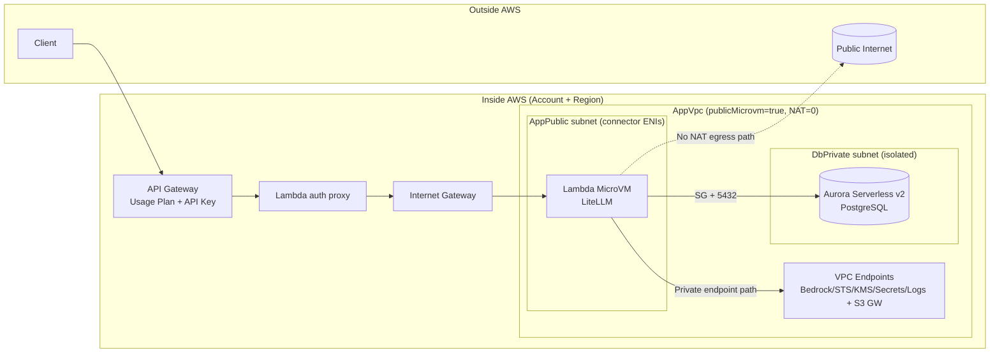
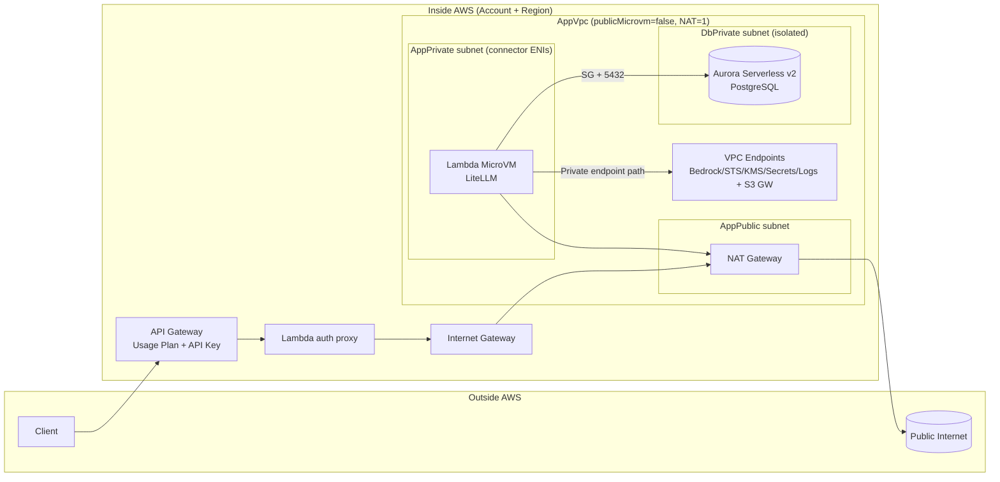
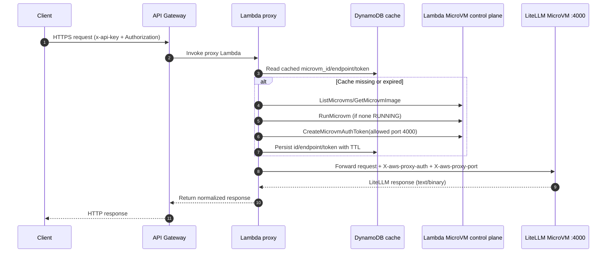

# LiteLLM AWS Lambda MicroVM Serverless


AWS-only deployment of LiteLLM on Lambda MicroVM with Aurora Serverless v2, API Gateway, and CDK.

## Architecture

`Client -> API Gateway (usage plan + API key) -> Lambda proxy -> Lambda MicroVM (LiteLLM) -> Aurora + Bedrock`

### Mode 1: `publicMicrovm=true` (default, no NAT)



### Mode 2: `publicMicrovm=false` (private mode with NAT)



Key design choices:

- `publicMicrovm=true` (default): MicroVM connector subnets are public, NAT = `0`, DB remains private.
- Aurora is always in isolated private DB subnets.
- Runtime MicroVM egress uses a VPC connector so LiteLLM can always reach Aurora.
- Private AWS service access is through VPC endpoints (Bedrock, STS, KMS, Secrets Manager, CloudWatch Logs, S3 gateway).

## Mode comparison table (security + cost)

| Dimension | `publicMicrovm=true` (default) | `publicMicrovm=false` (private mode) | Security / cost impact |
|---|---|---|---|
| MicroVM connector subnet | `AppPublic` | `AppPrivate` (`PRIVATE_WITH_EGRESS`) | Private mode reduces direct network exposure surface for connector ENIs. |
| NAT gateway | None (`natGateways: 0`) | One NAT (`natGateways: 1`) | Public mode has lower fixed baseline cost; private mode adds steady NAT cost. |
| Aurora subnet | `DbPrivate` isolated | `DbPrivate` isolated | Same DB isolation in both modes. |
| Aurora reachability from MicroVM | Via VPC egress connector + SG allow 5432 from connector SG | Same | Same security posture for DB path. |
| Private AWS service access | Interface VPC endpoints + S3 gateway endpoint | Same | Keeps Bedrock/STS/KMS/Secrets/Logs on private VPC endpoint paths in both modes. |
| Public internet path from MicroVM runtime | Not the intended default path in this mode | Available through NAT from private subnets | Private mode supports controlled outbound internet dependency; public mode is optimized for private targets. |
| API ingress/auth layers | API Gateway `x-api-key` + LiteLLM `Authorization` bearer key | Same | Same application/API auth posture across modes. |
| Operational complexity | Lower (no NAT routing/cost management) | Higher (NAT lifecycle and routing to maintain) | Public mode is simpler; private mode is stricter network posture with extra ops/cost overhead. |
| Main cost drivers beyond networking | Bedrock inference, Aurora ACU/storage, API/Lambda/Logs traffic | Same + NAT baseline | Workload costs are similar; mode choice mainly changes networking baseline and outbound behavior. |

### Which mode to choose

- Choose **`publicMicrovm=true`** when your runtime path is mainly private AWS targets (Aurora + VPC endpoints) and you want the lowest fixed baseline cost.
- Choose **`publicMicrovm=false`** when you need consistent outbound internet egress from runtime and prefer private connector subnet placement even with higher baseline cost.

## What this stack creates

- VPC and subnets:
  - `publicMicrovm=true`: `AppPublic` + `DbPrivate`
  - `publicMicrovm=false`: `AppPublic` + `AppPrivate` + `DbPrivate` (includes NAT)
- Aurora PostgreSQL Serverless v2 (`min ACU 0`, `max ACU 2`)
- Lambda MicroVM image resource (`AWS::Lambda::MicrovmImage`) and runtime settings
- API Gateway REST API with:
  - required API key (`x-api-key`)
  - binary media types enabled (`*/*`)
  - public and admin usage plans
- Lambda proxy that:
  - auto-discovers/starts MicroVM
  - creates MicroVM auth token
  - injects `X-aws-proxy-auth` and `X-aws-proxy-port`
  - preserves text/binary responses correctly
- Secrets Manager secrets for:
  - API Gateway key (`AwsGatewayApiKeySecretArn`)
  - LiteLLM master key parts (`LiteLlmMasterKeySecretArn`, `prefix + suffix`)
- DynamoDB TTL cache table for MicroVM/token proxy state
- ECR + CodeBuild project for ARM64 LiteLLM base image mirroring

## Operational findings (important)

- **No NAT in default mode:** `publicMicrovm=true` sets `natGateways: 0`.
- **DB is private while MicroVM can be public subnet-attached:** supported in this stack.
- **Proxy concurrency bottleneck fixed:** reserved concurrency is `50` (was too low for UI asset fan-out).
- **API throttling tuned:** public and admin usage plans have higher burst/rate for practical use.
- **Static assets stability:** API Gateway binary media types + proxy binary-safe forwarding avoid UI asset corruption/500s.
- **Auth bug fixed in key script:** `/key/generate` now sends real Bearer master key in `Authorization`.
- **Missing IAM fixed:** proxy role includes `lambda:GetMicrovmImage` and `lambda:TerminateMicrovm`.
- **Log retention standardized:** MicroVM runtime logs, proxy Lambda logs, API Gateway access/execution logs are `7 days`.
- **Direct admin access path works:** local connector script reaches MicroVM directly and serves `/ui`.
- **API Gateway key reuse constraint:** a single API key cannot be attached to multiple usage plans on the same stage.

## Lambda proxy call interaction



### Proxy token-cache flow (no magic)

```text
1) Proxy resolves active MicroVM (id + endpoint).
2) Proxy cache key stores:
   - microvm_id
   - microvm_endpoint
   - token
   - token_expires_at
   - token_microvm_id
3) Reuse token only when:
   - token not near expiry, AND
   - token_microvm_id == current microvm_id
4) If MicroVM changes (replace/restart/new version), invalidate cached token first.
5) Generate new X-aws-proxy-auth token for the current microVM id and persist.
```

### Stale-token bug and fix

- Symptom: intermittent `403 Token authentication failed` after MicroVM replacement/rotation.
- Root cause: cached MicroVM auth token could be reused after VM id changed.
- Fix in `infra/cdk/lambda/microvm_proxy.py`:
  - bind cached token to `token_microvm_id`
  - invalidate token when active `microvm_id` changes or cached VM lookup fails
  - persist/load `token_microvm_id` in DynamoDB cache item

This prevents proxy forwarding a token issued for a deleted/old MicroVM.

### Why proxy uses DynamoDB (design)

The proxy Lambda uses DynamoDB by design for two different data classes:

1. `MicrovmProxyCacheTable` (**cache/coordination state**)
   - stores `microvm_id`, `microvm_endpoint`, `token`, `token_expires_at`, `token_microvm_id`
   - purpose: share hot state across Lambda cold starts and concurrent execution environments
   - without this shared state, each Lambda environment would behave independently and repeatedly create tokens/start checks

2. `IamPrincipalKeyMapTable` (**authorization mapping source of truth**)
   - stores IAM principal ARN -> LiteLLM key mapping
   - used only for `/iam/...` route authorization/injection
   - this is not a cache; it is the persistent auth mapping data model

So DynamoDB is not only for caching. One table is runtime cache coordination, the other is persistent IAM auth mapping.

## Deploy

Edit `infra/cdk/cdk-settings.yaml` first:

```yaml
microvmRegion: us-east-1
vertexAiProject: <gcp-project-id>
vertexAiLocation: <gcp-region>
vertexCredentialsFile: /absolute/path/to/vertex-service-account.json
azureOpenAiConfigFile: /absolute/path/to/azure-openai.json
publicMicrovm: true
useCodebuildEcrBaseImage: false
```

Or set credentials file path outside settings:

```bash
export VERTEX_CREDENTIALS_FILE=/absolute/path/to/vertex-service-account.json
# or pass context: -c vertexCredentialsFile=/absolute/path/to/vertex-service-account.json
```

Azure OpenAI config file format:

```json
{
  "apiBase": "https://YOUR_AZURE_OPENAI_RESOURCE.openai.azure.com",
  "apiKey": "YOUR_AZURE_OPENAI_API_KEY",
  "apiVersion": "2024-08-01-preview"
}
```

Set Azure config file path:

```bash
export AZURE_OPENAI_CONFIG_FILE=/absolute/path/to/azure-openai.json
# or pass context: -c azureOpenAiConfigFile=/absolute/path/to/azure-openai.json
```

Mock file in repo:

```text
infra/cdk/examples/azure-openai.mock.json
```

Deploy and save stack outputs to `output.json`:

```bash
cd infra/cdk
./scripts/deploy-stack.sh
```

Private mode (NAT enabled) with custom output file:

```bash
cd infra/cdk
# set publicMicrovm: false in cdk-settings.yaml
./scripts/deploy-stack.sh --output-file output.json
```

Direct CDK commands (equivalent):

```bash
cd infra/cdk
npm install
npm run build
npx cdk deploy PrivateLiteLlmMicrovmStack --require-approval never -c settingsFile=cdk-settings.yaml
```

Private-mode deployment (NAT enabled):

```bash
npx cdk deploy PrivateLiteLlmMicrovmStack --require-approval never -c settingsFile=cdk-settings.yaml -c publicMicrovm=false
```

Optional base-image modes:

```bash
# set these in cdk-settings.yaml:
#   useCodebuildEcrBaseImage: true
#   microvmContainerBaseImage: "<account>.dkr.ecr.<region>.amazonaws.com/<repo>:<tag>"
npx cdk deploy PrivateLiteLlmMicrovmStack -c settingsFile=cdk-settings.yaml
```

## Auth model (two layers)

### Master key + request key flow (draw first)

```text
CDK deploy
  ├─ Secrets Manager: LiteLlmMasterKeySecretArn  -> {"prefix":"sk-","suffix":"..."}
  ├─ Secrets Manager: AwsGatewayApiKeySecretArn  -> {"apiKey":"..."}
  ├─ MicroVM image env: LITELLM_MASTER_KEY = prefix+suffix
  └─ API Gateway API key value = AwsGatewayApiKeySecretArn.apiKey

Admin key creation (create-api-key.sh / create-iam-key-mapping.sh)
  1) Read AwsGatewayApiKeySecretArn.apiKey
  2) Read LiteLlmMasterKeySecretArn.(prefix+suffix)
  3) Call POST /key/generate with:
       x-api-key: <gateway key>           (API Gateway layer)
       Authorization: Bearer <master key> (LiteLLM admin layer)
  4) LiteLLM returns generated user key (sk-...)
  5) Script creates API Gateway API key with SAME sk-... and attaches usage plan

Runtime client call (/chat/completions etc.)
  - x-api-key: sk-...                -> must exist in API Gateway usage plan
  - Authorization: Bearer sk-...     -> must exist in LiteLLM key store
```

Master key scope:

- `LITELLM_MASTER_KEY` is for LiteLLM admin operations (`/key/generate`, admin UI login).
- API Gateway does **not** use the master key for request auth.
- API Gateway uses API keys in usage plans (first-layer gate).

Every API request requires both:

1. API Gateway key in header `x-api-key`
2. LiteLLM key in header `Authorization: Bearer <litellm-key>`

> **Important:** Creating a key only in LiteLLM is not enough in this AWS setup.  
> The same key value must also exist as an API Gateway API key and be attached to a usage plan, otherwise API Gateway rejects the request before LiteLLM sees it.

### OpenClaw settings (exact fields)

Use the existing path (`/...`) with OpenAI-compatible provider:

1. Open OpenClaw **Settings** -> **Models** -> **Providers**.
2. Add or edit provider id `litellm`.
3. Set `baseUrl` to `https://<api-id>.execute-api.<region>.amazonaws.com/prod/`.
4. Set `api` to `openai-completions`.
5. Set `apiKey` to your generated user key (`sk-...`).
6. Add custom header `x-api-key` with the same `sk-...` value.
7. Select model id `nova-2-lite` (or another mapped model id from this stack).

Provider example:

```json
{
  "litellm": {
    "baseUrl": "https://<api-id>.execute-api.<region>.amazonaws.com/prod/",
    "apiKey": "sk-<user-key>",
    "api": "openai-completions",
    "headers": {
      "x-api-key": "sk-<user-key>"
    },
    "models": [
      { "id": "nova-2-lite", "name": "nova-2-lite" }
    ]
  }
}
```

## Parallel auth paths (existing + IAM)

- **Existing path (`/...`)**: API Gateway API key (`x-api-key`) + LiteLLM bearer key in `Authorization` (unchanged workflow).
- **IAM path (`/iam/...`)**: API Gateway `AWS_IAM` auth (SigV4). Proxy maps IAM principal ARN to LiteLLM key and injects bearer auth for LiteLLM.
- On `/iam/...`, client-supplied `Authorization`/API-key headers are ignored for app auth; proxy enforces IAM principal mapping.
- CDK also bootstraps one default IAM principal mapping on deploy:
  - creates role output `IamRouteCallerRoleArn`
  - custom resource generates a LiteLLM key alias `iam-route-default`
  - custom resource writes mapping to `IamPrincipalKeyMapTableName`

Relevant stack outputs:

- `PublicApiInvokeUrl`
- `AwsGatewayApiKeySecretArn`
- `LiteLlmMasterKeySecretArn`
- `AwsGatewayUsagePlanId` (client/public)
- `AwsGatewayAdminUsagePlanId` (admin/browser)

Fetch secrets:

```bash
API_KEY_JSON=$(aws secretsmanager get-secret-value --secret-id <AwsGatewayApiKeySecretArn> --query SecretString --output text)
MASTER_JSON=$(aws secretsmanager get-secret-value --secret-id <LiteLlmMasterKeySecretArn> --query SecretString --output text)
```

## Script reference (detailed)

### `infra/cdk/scripts/deploy-stack.sh`

Purpose:

- Deploys `PrivateLiteLlmMicrovmStack`.
- Writes CDK stack outputs to JSON file (default `infra/cdk/output.json`).

Arguments:

| Flag | Required | Description |
|---|---|---|
| `--config` | no | CDK settings YAML path (`default: cdk-settings.yaml`) |
| `--output-file` | no | Output JSON path relative to `infra/cdk` (`default: output.json`) |
| `--stack` | no | CloudFormation stack name override |

Examples:

```bash
cd infra/cdk
./scripts/deploy-stack.sh
./scripts/deploy-stack.sh --config cdk-settings.yaml --output-file output.json
```

### `infra/cdk/scripts/create-api-key.sh`

Purpose:

- Generates one LiteLLM user key and registers the same value in API Gateway usage plan.
- Pulls required stack outputs and secrets automatically.
- Saves key to local file for reuse.

Required IAM permissions:

- `cloudformation:DescribeStacks`
- `secretsmanager:GetSecretValue`
- `apigateway:CreateApiKey`
- `apigateway:CreateUsagePlanKey`

Arguments:

| Flag | Required | Description |
|---|---|---|
| `--usage-plan-id` | yes | API Gateway usage plan id to attach the key |
| `--alias` | yes | Unique key alias in LiteLLM |
| `--duration` | no | LiteLLM key duration (`default: 24h`) |
| `--models` | no | Comma-separated model allowlist |
| `--key` | no | Use explicit key value instead of random generation |
| `--output-file` | no | Output path (`default: .keys/<alias>.txt`) |
| `--json` | no | Print full API response JSON instead of key only |
| `--stack` | no | CloudFormation stack name override |
| `--region` | no | AWS region override |

Examples:

```bash
cd infra/cdk
PUBLIC_PLAN_ID=$(aws cloudformation describe-stacks --stack-name PrivateLiteLlmMicrovmStack --region us-east-1 --query "Stacks[0].Outputs[?OutputKey=='AwsGatewayUsagePlanId'].OutputValue" --output text)
ADMIN_PLAN_ID=$(aws cloudformation describe-stacks --stack-name PrivateLiteLlmMicrovmStack --region us-east-1 --query "Stacks[0].Outputs[?OutputKey=='AwsGatewayAdminUsagePlanId'].OutputValue" --output text)

./scripts/create-api-key.sh --usage-plan-id "$PUBLIC_PLAN_ID" --alias team-a --duration 7d --models nova-2-lite
./scripts/create-api-key.sh --usage-plan-id "$ADMIN_PLAN_ID" --alias admin-ui --duration 7d
./scripts/create-api-key.sh --usage-plan-id "$PUBLIC_PLAN_ID" --alias ci --duration 24h --output-file .keys/ci.txt
```

Expected output:

- `Attached key to usage plan id: <id>`
- `Saved generated key to: <path>`
- final line is generated key (unless `--json` is used)

Plan ID source:

- **CDK default plans**: use stack outputs `AwsGatewayUsagePlanId` / `AwsGatewayAdminUsagePlanId`.
- **User-created plans**: pass your custom API Gateway usage plan ID directly.
- Script behavior is the same for both because it always uses explicit `--usage-plan-id`.

Validation rules / fail-fast behavior:

- No fallback behavior.
- Key must start with `sk-`.
- Key length must be `20-128` (API Gateway limit).
- Script fails if `/key/generate` does not return the exact requested key.
- This script intentionally handles both sides (LiteLLM + API Gateway). Do not create LiteLLM-only keys for client traffic.

### `infra/cdk/scripts/create-vertex-service-account.sh`

Purpose:

- Creates a Google service account key JSON for LiteLLM Vertex Gemini calls.
- Enables Vertex AI API and grants minimum available role in this setup: `roles/aiplatform.user`.

Arguments:

| Flag | Required | Description |
|---|---|---|
| `--project-id` | yes | GCP project id |
| `--service-account-id` | no | Service account id (`default: litellm-vertex-gemini`) |
| `--display-name` | no | Service account display name |
| `--output-file` | no | JSON key output path (`default: .keys/vertex-<project>-<id>.json`) |
| `--overwrite` | no | `true` to overwrite existing output file |
| `--grant-service-usage-consumer` | no | `true` to also grant `roles/serviceusage.serviceUsageConsumer` |

Example:

```bash
cd infra/cdk
./scripts/create-vertex-service-account.sh --project-id my-gcp-project
```

### `infra/cdk/scripts/connect-admin-ui.sh`

Purpose:

- Opens local browser access to LiteLLM admin UI through direct MicroVM connection.
- Does not use API Gateway for UI transport.
- Saves LiteLLM master key for web login to a local file (not printed).

Required IAM permissions:

- `cloudformation:DescribeStacks`
- `cloudformation:DescribeStackResource`
- `lambda:GetFunctionConfiguration`
- `lambda-microvms:ListMicrovms`
- `lambda-microvms:GetMicrovm`
- `lambda-microvms:RunMicrovm` (unless existing RUNNING microVM is found)
- `lambda-microvms:CreateMicrovmAuthToken`
- `secretsmanager:GetSecretValue`

Arguments:

| Flag | Required | Description |
|---|---|---|
| `--port` | no | Local listen port (`default: 8787`) |
| `--microvm-port` | no | Upstream app port on microVM (`default: 4000`) |
| `--token-minutes` | no | Auth token TTL minutes (`default: 60`) |
| `--master-key-file` | no | Output file for admin master key (`default: .keys/admin-master-key.txt`) |
| `--no-start` | no | Fail if no RUNNING microVM exists |
| `--stack` | no | CloudFormation stack name override |
| `--region` | no | AWS region override |

Run:

```bash
cd infra/cdk
./scripts/connect-admin-ui.sh
```

Expected output:

- `MicroVM ID: ...`
- `MicroVM endpoint: ...`
- `Local admin proxy: http://127.0.0.1:8787/ui`
- `LiteLLM admin login key file: ...`

Then open `http://127.0.0.1:8787/ui` and login using the key stored in that file.

Direct-microVM reachability note:

- with `ALL_INGRESS`, endpoint is directly reachable
- with private ingress policy, you need private network path (VPN/peering/bastion)

### Stack destroy (direct CDK command)

Run:

```bash
cd infra/cdk
npx cdk destroy PrivateLiteLlmMicrovmStack --force -c settingsFile=cdk-settings.yaml
```

### `infra/cdk/scripts/create-iam-key-mapping.sh`

Purpose:

- Creates a LiteLLM key and maps it to a specific IAM principal ARN for `/iam/...` routes.
- This is separate from API Gateway usage-plan key flow and does not modify existing public path workflow.

Arguments:

| Flag | Required | Description |
|---|---|---|
| `--principal-arn` | yes | IAM role/user ARN to map |
| `--alias` | yes | Unique LiteLLM key alias |
| `--duration` | no | Key duration (`default: 24h`) |
| `--models` | no | Comma-separated model allowlist |
| `--key` | no | Explicit key value |
| `--output-file` | no | Key output file (`default: .keys/iam-<alias>.txt`) |
| `--stack` | no | Stack name override |
| `--region` | no | Region override |

Example:

```bash
cd infra/cdk
./scripts/create-iam-key-mapping.sh \
  --principal-arn arn:aws:iam::123456789012:role/my-service \
  --alias svc-a \
  --duration 7d
```

Expected result:

- LiteLLM key is created via `/key/generate`
- mapping is written to `IamPrincipalKeyMapTableName`
- generated key is saved to local file
- when mapping a role ARN, STS assumed-role sessions for that role are accepted on `/iam/...`

### `infra/cdk/scripts/call-iam-endpoint.sh`

Purpose:

- Assumes the IAM role from stack outputs (`IamRouteCallerRoleArn`).
- Sends a SigV4-signed request to `/iam/...` routes on `PublicApiInvokeUrl`.
- Validates IAM path behavior without using API key headers.

Arguments:

| Flag | Required | Description |
|---|---|---|
| `--outputs-file` | no | CDK outputs JSON file (`default: output.json`) |
| `--stack` | no | Stack key inside outputs JSON (`default: PrivateLiteLlmMicrovmStack`) |
| `--role-arn` | no | Override role ARN (skip outputs lookup for role) |
| `--api-url` | no | Override API URL (skip outputs lookup for URL) |
| `--region` | no | AWS region (`default: us-east-1` unless env override) |
| `--path` | no | IAM path to call (`default: /iam/health/liveliness`) |
| `--method` | no | HTTP method (`default: GET`) |
| `--body` | no | Inline JSON body |
| `--body-file` | no | JSON body from file |
| `--session-duration-seconds` | no | STS session duration (`900-43200`, default `900`) |

Examples:

```bash
cd infra/cdk
./scripts/call-iam-endpoint.sh
./scripts/call-iam-endpoint.sh --path /iam/models
./scripts/call-iam-endpoint.sh --method POST --path /iam/chat/completions --body '{"model":"nova-2-lite","messages":[{"role":"user","content":"say hi"}]}'
```

### `infra/cdk/scripts/test-api-key-strands.py`

Purpose:

- Tests a generated key end-to-end using the **Strands Agents** framework against your API Gateway endpoint.
- Verifies both auth layers in one run:
  - API Gateway `x-api-key`
  - LiteLLM `Authorization: Bearer ...`

Prerequisite install (virtualenv recommended):

```bash
pip install 'strands-agents[openai]' strands-agents-tools
```

Run:

```bash
cd infra/cdk
python scripts/test-api-key-strands.py \
  --api-url "$PUBLIC_API_URL" \
  --api-key-file .keys/app-user.txt \
  --model nova-2-lite
```

Expected result:

- exits `0` and prints JSON with `"status": "ok"` and model response text

### `infra/cdk/scripts/test-api-key-strands.sh` (wrapper)

Purpose:

- Wrapper for Strands test that creates/reuses a local virtualenv and installs Strands deps.
- Resolves `PublicApiInvokeUrl` automatically from stack outputs if `--api-url` is not provided.
- Sets runtime values for you (`STRANDS_API_URL`, `STRANDS_API_KEY`) and runs the Python test.

Run with defaults (uses `.keys/user-key.txt`):

```bash
cd infra/cdk
./scripts/test-api-key-strands.sh
```

Run with explicit key file:

```bash
./scripts/test-api-key-strands.sh --api-key-file .keys/app-user.txt
```

Run with explicit endpoint + key:

```bash
./scripts/test-api-key-strands.sh \
  --api-url "https://<id>.execute-api.us-east-1.amazonaws.com/prod/" \
  --api-key "sk-..."
```

### `infra/cdk/scripts/test-aws-strands.sh`

Purpose:

- Runs API-key Strands checks for all AWS-backed models in config.
- Sends `hi` to each model and fails fast on first failing model.

Models covered:

- `nova-2-lite`
- `minimax-m2.5`
- `kimi-k2.5`

Run:

```bash
cd infra/cdk
./scripts/test-aws-strands.sh
```

### `infra/cdk/scripts/test-gcp-strands.sh`

Purpose:

- Runs API-key Strands checks for all GCP/Vertex-backed Gemini models in config.
- Sends `hi` to each model and fails fast on first failing model.

Models covered:

- `gemini-3.5-flash`
- `gemini-3.1-flash-lite`
- `gemini-3.1-flash-image-preview`
- `gemini-3.1-pro-preview`
- `gemini-3.1-pro-preview-customtools`
- `gemini-2.5-pro`
- `gemini-2.5-flash`
- `gemini-2.5-flash-lite`

Run:

```bash
cd infra/cdk
./scripts/test-gcp-strands.sh
```

### `infra/cdk/scripts/test-azure-strands.sh`

Purpose:

- Runs API-key Strands checks for all Azure models in config.
- Sends `hi` to each model and fails fast on first failing model.

Models covered:

- `gpt-5.2`
- `gpt-5.4-mini`
- `gpt-5.4-nano`
- `gpt-5.4`

Run:

```bash
cd infra/cdk
./scripts/test-azure-strands.sh
```

Optional overrides for all provider test scripts:

```bash
PROMPT="hi" MAX_TOKENS=64 TEMPERATURE=0.0 ./scripts/test-aws-strands.sh --api-key-file .keys/user-key.txt
```

### `infra/cdk/scripts/test-iam-strands.py`

Purpose:

- Tests IAM `/iam/...` path end-to-end using **Strands Agents**.
- Assumes IAM role, signs requests with SigV4 (`execute-api`), and calls OpenAI-compatible `/iam/chat/completions`.
- Does not use `x-api-key` or LiteLLM bearer key from client side.

Run:

```bash
cd infra/cdk
python scripts/test-iam-strands.py \
  --api-url "$PUBLIC_API_URL" \
  --role-arn "$IAM_ROLE_ARN" \
  --region us-east-1 \
  --model nova-2-lite
```

Expected result:

- exits `0` and prints JSON with `"status": "ok"` and model response text.

### `infra/cdk/scripts/test-iam-strands.sh` (wrapper)

Purpose:

- Wrapper for IAM Strands test that creates/reuses local virtualenv and installs deps.
- Resolves `PublicApiInvokeUrl` and `IamRouteCallerRoleArn` from `output.json` by default.
- Runs SigV4 IAM call path test with one command.

Run with defaults:

```bash
cd infra/cdk
./scripts/test-iam-strands.sh
```

Run with explicit role/API:

```bash
./scripts/test-iam-strands.sh \
  --role-arn arn:aws:iam::<account-id>:role/PrivateLiteLlmMicrovmStack-iam-route-caller \
  --api-url "https://<id>.execute-api.us-east-1.amazonaws.com/prod/" \
  --region us-east-1
```

## API user guide (end-to-end)

### 1) Load endpoint and keys from stack outputs/secrets

```bash
STACK_NAME=PrivateLiteLlmMicrovmStack
AWS_REGION=us-east-1

PUBLIC_API_URL=$(aws cloudformation describe-stacks \
  --stack-name "$STACK_NAME" --region "$AWS_REGION" \
  --query "Stacks[0].Outputs[?OutputKey=='PublicApiInvokeUrl'].OutputValue" --output text)

API_KEY_SECRET_ARN=$(aws cloudformation describe-stacks \
  --stack-name "$STACK_NAME" --region "$AWS_REGION" \
  --query "Stacks[0].Outputs[?OutputKey=='AwsGatewayApiKeySecretArn'].OutputValue" --output text)

API_KEY_JSON=$(aws secretsmanager get-secret-value --region "$AWS_REGION" --secret-id "$API_KEY_SECRET_ARN" --query SecretString --output text)
MASTER_KEY_SECRET_ARN=$(aws cloudformation describe-stacks \
  --stack-name "$STACK_NAME" --region "$AWS_REGION" \
  --query "Stacks[0].Outputs[?OutputKey=='LiteLlmMasterKeySecretArn'].OutputValue" --output text)
MASTER_JSON=$(aws secretsmanager get-secret-value --region "$AWS_REGION" --secret-id "$MASTER_KEY_SECRET_ARN" --query SecretString --output text)

API_GATEWAY_KEY=$(python - <<'PY' "$API_KEY_JSON"
import json,sys
print(json.loads(sys.argv[1])["apiKey"])
PY
)

LITELLM_MASTER_KEY=$(python - <<'PY' "$MASTER_JSON"
import json,sys
v=json.loads(sys.argv[1]); print((v.get("prefix") or "") + (v.get("suffix") or ""))
PY
)
```

### 2) Liveness check

```bash
curl -sS "${PUBLIC_API_URL%/}/health/liveliness" \
  -H "x-api-key: $API_GATEWAY_KEY" \
  -H "Authorization: Bearer $LITELLM_MASTER_KEY"
```

### 3) Create a user key (recommended via script)

```bash
cd infra/cdk
PUBLIC_PLAN_ID=$(aws cloudformation describe-stacks --stack-name "$STACK_NAME" --region "$AWS_REGION" --query "Stacks[0].Outputs[?OutputKey=='AwsGatewayUsagePlanId'].OutputValue" --output text)
./scripts/create-api-key.sh --usage-plan-id "$PUBLIC_PLAN_ID" --alias app-user --duration 7d --models nova-2-lite
USER_KEY=$(cat .keys/app-user.txt)
```

Manual `/key/generate` call (if needed):

```bash
curl -sS -X POST "${PUBLIC_API_URL%/}/key/generate" \
  -H "x-api-key: $API_GATEWAY_KEY" \
  -H "Authorization: Bearer $LITELLM_MASTER_KEY" \
  -H "Content-Type: application/json" \
  --data-raw '{"key_alias":"manual-user","duration":"24h"}'
```

### 4) Call chat completions with user key

```bash
curl -sS -X POST "${PUBLIC_API_URL%/}/chat/completions" \
  -H "x-api-key: $API_GATEWAY_KEY" \
  -H "Authorization: Bearer $USER_KEY" \
  -H "Content-Type: application/json" \
  --data-raw '{
    "model":"nova-2-lite",
    "messages":[{"role":"user","content":"hello"}]
  }'
```

### 5) Optional: test key with Strands framework

```bash
cd infra/cdk
./scripts/test-api-key-strands.sh --api-key "$USER_KEY" --api-url "$PUBLIC_API_URL"
```

### 6) IAM route usage (`/iam/...`)

After creating IAM mapping with `create-iam-key-mapping.sh`, call IAM route with SigV4:

Sign normal HTTPS requests with IAM credentials to:

- `${PUBLIC_API_URL%/}/iam/chat/completions`

The proxy resolves IAM principal ARN from request context and injects mapped LiteLLM bearer key.

### 7) Common errors

| Symptom | Typical cause | Action |
|---|---|---|
| `403 Forbidden` from API Gateway | missing/invalid `x-api-key` | confirm `AwsGatewayApiKeySecretArn` value and header |
| `401` from LiteLLM endpoints | missing/invalid Authorization bearer header | use master key for admin endpoints or valid generated user key |
| `403` on `/iam/...` with message about principal mapping | IAM principal has no mapped LiteLLM key | run `create-iam-key-mapping.sh --principal-arn ... --alias ...` |
| `429` | usage-plan throttle/quota exceeded | use admin/public key on correct usage plan, then retry |
| `500/502` on first requests | microVM startup/token lifecycle in progress | retry request; check proxy and microVM logs |

## API and logging behavior

- API Gateway:
  - stage: `prod`
  - logging level: `ERROR`
  - access logs enabled (JSON format)
  - execution logs retained for 7 days
- Lambda proxy logs retained for 7 days
- MicroVM runtime logs (`/aws/lambda-microvms/<image-name>`) retained for 7 days

## MicroVM runtime settings (LiteLLM fit)

- minimum memory in image config: `2048 MiB`
- idle policy:
  - `maxIdleDurationSeconds = 900`
  - `suspendedDurationSeconds = 28800`
- maximum duration:
  - `maximumDurationInSeconds = 28800`

## Model source of truth: DB vs YAML

In this stack, model configuration is expected to be **database-driven at runtime**.

- `STORE_MODEL_IN_DB=True` is set on the MicroVM image environment.
- `DATABASE_URL` is also injected, pointing LiteLLM to Aurora.
- Therefore, model changes should be done via LiteLLM admin/API (persisted in DB), not by editing YAML for day-to-day operations.

Practical impact:

- Changing model settings in LiteLLM admin/API: **no MicroVM image rebuild required**.
- Changing `infra/cdk/microvm-image/config.yaml`: affects the baked image config and therefore requires image rebuild/redeploy to change bootstrap/default image content.

### LiteLLM documentation references

- https://docs.litellm.ai/docs/proxy/ui_store_model_db_setting  
  (Store Model in DB behavior, immediate effect, and config-file override semantics)
- https://docs.litellm.ai/docs/proxy/model_management  
  (model management APIs like `/model/new` and `/model/info` for runtime updates)

## Cost behavior summary

- Default mode avoids NAT cost (`publicMicrovm=true`).
- Main cost drivers are typically:
  - model inference (Bedrock)
  - Aurora compute/storage
- API Gateway/Lambda/CloudWatch costs are usually smaller unless high sustained traffic.

## Known deployment caveat

`AWS::Lambda::MicrovmImage` can occasionally fail CloudFormation stabilization (`NotStabilized`) even when a newer version later becomes active.

Practical workaround:

1. Retry `cdk deploy` for image stabilization races.
2. Verify latest MicroVM image/runtime logs in CloudWatch.
3. Keep infra/network/database changes separate from image retries.

## Repository layout

```text
infra/cdk/
  bin/
  lib/
  lambda/
  microvm-image/
  scripts/
    create-api-key.sh
    connect-admin-ui.sh
```

## Destroy

```bash
cd infra/cdk
npx cdk destroy PrivateLiteLlmMicrovmStack --force -c settingsFile=cdk-settings.yaml
```
