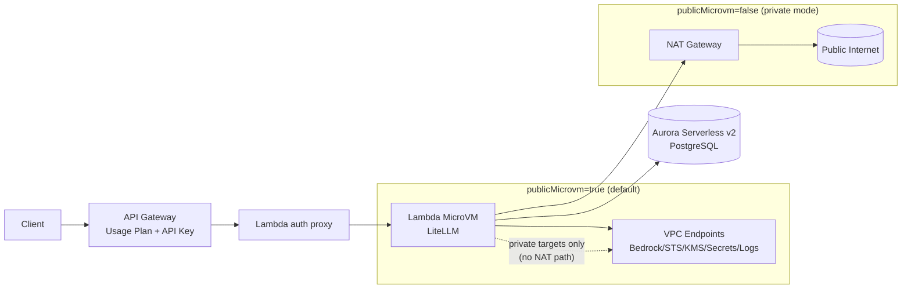

# LiteLLM Proxy Setup

A production-ready LiteLLM Proxy configuration supporting **Google Vertex AI (Gemini 3.5, 3.1, 3.0, 2.5)**, **AWS Bedrock (Nova + Minimax + Kimi)**, and **Azure OpenAI (GPT-5.2)** with PostgreSQL persistence and virtual key budgeting.

## 🚀 Quick Start

### 1. Prerequisites
*   **Docker & Docker Compose** installed.
*   **Google Cloud SDK (`gcloud`)** authenticated for Vertex AI:
    ```bash
    gcloud auth application-default login
    ```
*   **AWS Bedrock long-term API key** (for Bedrock models).
*   **Azure OpenAI API Key** and Resource Endpoint.

### 2. Configuration
Create the `.env` file with your actual credentials from `.env.template`.
#### Google Cloud Authentication
Execute the authentication command to set up your Google Cloud credentials:
```bash
gcloud auth application-default login
```

#### Azure OpenAI Setup
Ensure your Azure OpenAI API Key and Resource Endpoint are available for the `.env` configuration.

#### AWS Bedrock Setup (Long-term API Key)
Set your Bedrock long-term API key and AWS region in `.env`:

```bash
AWS_BEARER_TOKEN_BEDROCK=<YOUR_AWS_BEDROCK_LONG_TERM_API_KEY>
AWS_REGION=us-east-1
```

##### IAM policy required for Nova models
Create and attach an IAM policy to the IAM user/role that will generate and use the Bedrock long-term API key:

```json
{
    "Version": "2012-10-17",
    "Statement": [
        {
            "Effect": "Allow",
            "Action": [
                "bedrock:InvokeModel",
                "bedrock:InvokeModelWithResponseStream",
                "bedrock-mantle:CreateInference"
            ],
            "Resource": [
                "arn:aws:bedrock:*:*:inference-profile/global.amazon.nova-2-lite-v1:0",
                "arn:aws:bedrock:*::foundation-model/amazon.nova-2-lite-v1:0",
                "arn:aws:bedrock:*::foundation-model/minimax.minimax-m2.5",
                "arn:aws:bedrock:*::foundation-model/moonshotai.kimi-k2.5",
                "arn:aws:bedrock-mantle:us-east-2:*:project/default"
            ]
        },
        {
            "Effect": "Allow",
            "Action": [
                "bedrock-mantle:CallWithBearerToken",
                "bedrock:CallWithBearerToken"
            ],
            "Resource": "*"
        }
    ]
}
```

After attaching this policy:
1. Create or rotate your Bedrock long-term API key from the same IAM principal.
2. Put that key into `AWS_BEARER_TOKEN_BEDROCK` in `.env`.
3. Restart the stack with `docker compose up -d` if it is already running.

If you are using `.env.template`, copy it first and then fill these fields:

```bash
cp .env.template .env
```

### 3. Deployment
```bash
docker compose up -d
```

### 4. Reset Everything
If you want to wipe the Docker state and start fresh, remove the stack and the named Postgres volume:

```bash
docker compose down -v --remove-orphans
docker compose up -d
```

---

## 🛠 Supported Models

| Model Alias | Provider | Underlying Model |
| :--- | :--- | :--- |
| **`gemini-3.5-flash`** | Vertex AI | `vertex_ai/gemini-3.5-flash` |
| **`gemini-3.1-flash-lite`** | Vertex AI | `vertex_ai/gemini-3.1-flash-lite` |
| **`gemini-3.1-flash-image-preview`** | Vertex AI | `vertex_ai/gemini-3.1-flash-image-preview` |
| **`gemini-3.1-pro-preview`** | Vertex AI | `vertex_ai/gemini-3.1-pro-preview` |
| **`gemini-3.1-pro-preview-customtools`** | Vertex AI | `vertex_ai/gemini-3.1-pro-preview` (with tools) |
| **`gemini-3-flash-preview`** | Vertex AI | `vertex_ai/gemini-3-flash-preview` |
| **`gemini-2.5-pro`** | Vertex AI | `vertex_ai/gemini-2.5-pro` |
| **`gemini-2.5-flash`** | Vertex AI | `vertex_ai/gemini-2.5-flash` |
| **`gemini-2.5-flash-lite`** | Vertex AI | `vertex_ai/gemini-2.5-flash-lite` |
| **`nova-2-lite`** | AWS Bedrock | `bedrock/global.amazon.nova-2-lite-v1:0` |
| **`minimax-m2.5`** | AWS Bedrock | `bedrock/minimax.minimax-m2.5` |
| **`kimi-k2.5`** | AWS Bedrock | `bedrock/moonshotai.kimi-k2.5` |
| **`gpt-5.2`** | Azure OpenAI | `azure/gpt-5.2` (with reasoning support) |

---

## 🔑 Key & Budget Management
Track spending and create virtual keys with PostgreSQL.

#### Generate a new key with a budget:
```bash
curl -X POST 'http://localhost:4000/key/generate' \
  -H 'Authorization: Bearer <YOUR_MASTER_KEY_STARTING_WITH_sk->' \
  -H 'Content-Type: application/json' \
  --data-raw '{
    "key_alias": "openlaw-key",
    "models": [],
    "max_budget": 10,
    "budget_duration": "1d",
    "metadata": {"owner": "team-core"}
  }'
```

### CDK deployment auth flow
When using the CDK stack API endpoint, API Gateway and LiteLLM are separate auth layers:
* API Gateway usage-plan key in `x-api-key`.
* LiteLLM key in `Authorization: Bearer <key>`.

CDK outputs these auth-related values:
* `AwsGatewayApiKeySecretArn` (JSON payload with `apiKey`)
* `LiteLlmMasterKeySecretArn` (JSON payload with `prefix` + `suffix`, combine as master key)
* `AwsGatewayUsagePlanId` (public/client usage plan)
* `AwsGatewayAdminUsagePlanId` (admin/UI usage plan with higher burst throttle)

For day-to-day calls, use one generated LiteLLM user key as `Authorization: Bearer <key>`.
Fetch values for setup/testing:
```bash
API_KEY=$(aws secretsmanager get-secret-value --secret-id <AwsGatewayApiKeySecretArn> --query SecretString --output text | jq -r '.apiKey')
MASTER_KEY=$(aws secretsmanager get-secret-value --secret-id <LiteLlmMasterKeySecretArn> --query SecretString --output text | jq -r '.prefix + .suffix')
```

Or use the admin helper script (pulls stack outputs/secrets, generates one API-Gateway-compatible key, sends it to `/key/generate`, then registers the exact same key in API Gateway usage plan):
```bash
cd infra/cdk
./scripts/create-api-key.sh --alias team-a --duration 7d --models nova-2-lite
./scripts/create-api-key.sh --alias admin-ui --duration 7d --usage-plan admin
```
The script is fail-fast only (no fallback). Use `--key <value>` if you want to provide your own key explicitly.
The script enforces `sk-` prefix and API Gateway length limits (20-128 chars).
Use `--usage-plan admin` for browser/admin UI keys and `--usage-plan public` (default) for regular client keys.
The script saves the generated key to `.keys/<alias>.txt` by default (or `--output-file <path>`).

For browser admin access without extension header rules, use local direct MicroVM proxy:
```bash
cd infra/cdk
./scripts/connect-admin-ui.sh
```
Then open `http://127.0.0.1:8787/ui`.
The script prints the LiteLLM admin login key (master key) to use in the web login view.
This works in both public and private subnet modes because the script reads the stack's configured
MicroVM egress connector and starts/uses a DB-capable MicroVM with direct MicroVM auth token flow.
This direct MicroVM access pattern is AWS-supported: resolve endpoint (`GetMicrovm`) + create token
(`CreateMicrovmAuthToken`) + send `X-aws-proxy-auth`/allowed port headers. Reachability from your
client depends on ingress connector policy: with `ALL_INGRESS` it is directly reachable; with
private-only ingress you need private connectivity (VPN/peering/bastion path) to reach the endpoint.

Example:
```bash
curl -X POST 'https://<api-id>.execute-api.<region>.amazonaws.com/prod/key/generate' \
  -H 'x-api-key: <aws-api-gateway-key>' \
  -H 'Authorization: Bearer <litellm-master-key>' \
  -H 'Content-Type: application/json' \
  --data-raw '{"duration":"24h","key_alias":"user-key-1"}'
```

Then call models with the generated user key:
```bash
curl -X POST 'https://<api-id>.execute-api.<region>.amazonaws.com/prod/chat/completions' \
  -H 'x-api-key: <aws-api-gateway-key>' \
  -H 'Authorization: Bearer <litellm-user-key>' \
  -H 'Content-Type: application/json' \
  --data-raw '{"model":"nova-2-lite","messages":[{"role":"user","content":"hello"}]}'
```


## Model Config in OpenClaw

```
  "models": {
    "mode": "merge",
    "providers": {
      "litellm": {
        "baseUrl": "http://<your proxy ip>:4000",
        "api": "openai-completions",
        "models": [
          {
            "id": "gemini-3.5-flash",
            "name": "gemini-3.5-flash",
            "reasoning": true,
            "input": [
              "text",
              "image"
            ],
            "cost": {
              "input": 0,
              "output": 0,
              "cacheRead": 0,
              "cacheWrite": 0
            },
            "contextWindow": 1048576,
            "maxTokens": 8192
          },
          {
            "id": "gemini-3.1-flash-lite",
            "name": "gemini-3.1-flash-lite",
            "reasoning": true,
            "input": [
              "text",
              "image"
            ],
            "cost": {
              "input": 0,
              "output": 0,
              "cacheRead": 0,
              "cacheWrite": 0
            },
            "contextWindow": 128000,
            "maxTokens": 8192
          },
          {
            "id": "gpt-5.2",
            "name": "gpt-5.2",
            "reasoning": true,
            "input": [
              "text",
              "image"
            ],
            "cost": {
              "input": 0,
              "output": 0,
              "cacheRead": 0,
              "cacheWrite": 0
            },
            "contextWindow": 128000,
            "maxTokens": 8192
          },
          {
            "id": "gemini-3.1-flash-image-preview",
            "name": "gemini-3.1-flash-image-preview",
            "reasoning": true,
            "input": [
              "text",
              "image"
            ],
            "cost": {
              "input": 0,
              "output": 0,
              "cacheRead": 0,
              "cacheWrite": 0
            },
            "contextWindow": 128000,
            "maxTokens": 8192
          },
          {
            "id": "gemini-3.1-pro-preview",
            "name": "gemini-3.1-pro-preview",
            "reasoning": true,
            "input": [
              "text",
              "image"
            ],
            "cost": {
              "input": 0,
              "output": 0,
              "cacheRead": 0,
              "cacheWrite": 0
            },
            "contextWindow": 2097152,
            "maxTokens": 8192
          },
          {
            "id": "gemini-3.1-pro-preview-customtools",
            "name": "gemini-3.1-pro-preview-customtools",
            "reasoning": true,
            "input": [
              "text",
              "image"
            ],
            "cost": {
              "input": 0,
              "output": 0,
              "cacheRead": 0,
              "cacheWrite": 0
            },
            "contextWindow": 2097152,
            "maxTokens": 8192
          },
          {
            "id": "gemini-3-flash-preview",
            "name": "gemini-3-flash-preview",
            "reasoning": true,
            "input": [
              "text",
              "image"
            ],
            "cost": {
              "input": 0,
              "output": 0,
              "cacheRead": 0,
              "cacheWrite": 0
            },
            "contextWindow": 1048576,
            "maxTokens": 8192
          },
          {
            "id": "gemini-2.5-pro",
            "name": "gemini-2.5-pro",
            "reasoning": true,
            "input": [
              "text",
              "image"
            ],
            "cost": {
              "input": 0,
              "output": 0,
              "cacheRead": 0,
              "cacheWrite": 0
            },
            "contextWindow": 2097152,
            "maxTokens": 8192
          },
          {
            "id": "gemini-2.5-flash",
            "name": "gemini-2.5-flash",
            "reasoning": false,
            "input": [
              "text",
              "image"
            ],
            "cost": {
              "input": 0,
              "output": 0,
              "cacheRead": 0,
              "cacheWrite": 0
            },
            "contextWindow": 1048576,
            "maxTokens": 8192
          },
          {
            "id": "gemini-2.5-flash-lite",
            "name": "gemini-2.5-flash-lite",
            "reasoning": false,
            "input": [
              "text",
              "image"
            ],
            "cost": {
              "input": 0,
              "output": 0,
              "cacheRead": 0,
              "cacheWrite": 0
            },
            "contextWindow": 1048576,
            "maxTokens": 8192
          },
          {
            "id": "nova-2-lite",
            "name": "nova-2-lite",
            "reasoning": false,
            "input": [
              "text",
              "image"
            ],
            "cost": {
              "input": 0,
              "output": 0,
              "cacheRead": 0,
              "cacheWrite": 0
            },
            "contextWindow": 300000,
            "maxTokens": 8192
          },
          {
            "id": "minimax-m2.5",
            "name": "minimax-m2.5",
            "reasoning": true,
            "input": [
              "text",
              "image"
            ],
            "cost": {
              "input": 0,
              "output": 0,
              "cacheRead": 0,
              "cacheWrite": 0
            },
            "contextWindow": 300000,
            "maxTokens": 8192
          },
          {
            "id": "kimi-k2.5",
            "name": "kimi-k2.5",
            "reasoning": true,
            "input": [
              "text",
              "image"
            ],
            "cost": {
              "input": 0,
              "output": 0,
              "cacheRead": 0,
              "cacheWrite": 0
            },
            "contextWindow": 300000,
            "maxTokens": 8192
          }
        ]
      }
    }
  },
```

---

## 🧪 Testing
Run the included test script:
```bash
./test_litellm.sh
```
To test specific models, use `curl` or `openclaw models set litellm/<model-alias>`.

## ☁️ CDK: Private Bedrock-only MicroVM + Aurora

This repository now includes a CDK stack at `infra/cdk` for the private architecture:

`Client -> Public API Gateway (Usage Plan + API Key) -> Lambda auth proxy -> Lambda MicroVM (LiteLLM) -> Aurora Serverless + Bedrock endpoints`



Private-mode deployment (`publicMicrovm=false`) was undeployed/redeployed and validated with live checks: `/health/liveliness`, `/key/generate`, and `/chat/completions` all returned `200`.

### What it creates
* VPC with public app subnets + isolated DB subnets (default), or private app subnets + NAT (private mode)
* Aurora PostgreSQL Serverless v2
* Public API Gateway + Usage Plan + API Key + Lambda proxy (injects `X-aws-proxy-auth` to MicroVM)
* VPC endpoints for Bedrock, Secrets Manager, KMS, STS, CloudWatch Logs, plus S3 gateway endpoint
* IAM roles and S3 artifact bucket for MicroVM image/build flow
* ECR repository + ARM64 CodeBuild project to mirror LiteLLM base image into private ECR
* DynamoDB cache table for proxy MicroVM/token state with TTL
* Custom resource post-deploy readiness check that calls LiteLLM `/health/liveliness` until it is `200` (max 5 minutes)

### Deploy
Deploy everything in one command (default creates MicroVM image from `infra/cdk/microvm-image`):
```bash
cd infra/cdk
npm install
npx cdk deploy \
  -c microvmRegion=<microvm-region> \
  -c publicMicrovm=true
```

Optional: use your own pre-uploaded artifact instead of the default packaged one:
```bash
npx cdk deploy \
  -c microvmRegion=<microvm-region> \
  -c publicMicrovm=true \
  -c microvmArtifactKey=images/litellm.zip
```

Private-mode option (MicroVM in private subnets with NAT + VPC endpoints):
```bash
npx cdk deploy \
  -c microvmRegion=<microvm-region> \
  -c publicMicrovm=false
```

Trial: use CodeBuild-mirrored private ECR base image (for machines that can't build ARM64):
```bash
# 1) Deploy infra (creates ECR + CodeBuild project outputs)
npx cdk deploy \
  -c microvmRegion=<microvm-region> \
  -c publicMicrovm=true

# 2) Start mirror build (project name from output LiteLlmArm64MirrorCodeBuildProjectName)
aws codebuild start-build --project-name <output-project-name>

# 3) Redeploy and force MicroVM Dockerfile FROM to private ECR image
npx cdk deploy \
  -c microvmRegion=<microvm-region> \
  -c useCodebuildEcrBaseImage=true \
  -c publicMicrovm=true
```

Destroy stack:
```bash
cd infra/cdk
./scripts/destroy-stack.sh
```

### Important
* The stack creates an `AWS::Lambda::MicrovmImage` resource natively via CDK/CloudFormation.
* `publicMicrovm` controls network mode:
  * `true` (default): MicroVM connector subnets are public (IGW route), no NAT.
  * `false`: MicroVM connector subnets are private-with-egress and NAT is created.
* Current code behavior (`infra/cdk/bin/app.ts` + `infra/cdk/lib/private-litellm-microvm-stack.ts`):
  * Single-phase deploy: runtime always uses VPC egress connector for Aurora path.
  * Stack-managed VPC connector is created unless `-c microvmEgressConnectorArn=<arn>` is provided.
  * `microvmEgressConnectorArn=...:INTERNET_EGRESS` is rejected by guardrail in `app.ts`.
  * `useCodebuildEcrBaseImage=true` rewrites MicroVM Dockerfile `FROM` at synth time to `<stack ECR repo>:main-stable`.
  * `microvmContainerBaseImage=<uri>` overrides the Dockerfile base image explicitly (higher priority than `useCodebuildEcrBaseImage`).
  * On stack delete, the readiness custom resource first terminates non-terminated MicroVMs for this stack image, then CloudFormation deletes the MicroVM image/resource.
  * A custom resource invokes the proxy Lambda directly (not API Gateway) and checks LiteLLM `/health/liveliness` until `200` (hard-fails after 5 minutes).
  * API Gateway usage-plan key source is `AUTHORIZER`; a request authorizer extracts the key from supported headers and maps it to `usageIdentifierKey`.
* The image default egress connector stays `INTERNET_EGRESS`.
* Runtime `RunMicrovm` egress uses the managed VPC connector for Aurora access.
* Bedrock and other AWS service reachability at runtime comes through VPC endpoints.
* Internet at runtime depends on mode:
  * `publicMicrovm=true` (default): VPC egress connector ENIs are in public subnets without NAT, so this mode is for private targets (Aurora/VPC endpoints), not guaranteed arbitrary public internet.
  * `publicMicrovm=false`: VPC egress connector ENIs are in private-with-egress subnets with NAT, so both private targets and public internet are available.
* The proxy no longer requires `microvmId` / `microvmEndpoint` input. It calls `ListMicrovms` and `RunMicrovm` automatically.
* Proxy state (`microvm_id`, endpoint, token expiration) is cached in DynamoDB TTL table to reduce control-plane API calls across Lambda cold starts.
* The MicroVM image now sets `LITELLM_MASTER_KEY` and `DATABASE_URL` automatically (master key is generated in Secrets Manager output `LiteLlmMasterKeySecretArn`).
* API Gateway usage-plan key value is generated in Secrets Manager output `AwsGatewayApiKeySecretArn` (JSON field `apiKey`).
* The proxy forwards incoming client auth headers to LiteLLM (including `x-api-key`) while still injecting internal `X-aws-proxy-*` headers.
* The proxy uses the stack-managed MicroVM image and managed egress connector by default.
* Optional override: `-c microvmEgressConnectorArn=<connector-arn>` to use an existing connector.
* `microvmEgressConnectorArn=...:INTERNET_EGRESS` is rejected to avoid breaking Aurora connectivity.
* Client authentication stays at LiteLLM application level; AWS proxy headers are injected only inside the private proxy hop.
* Current API invoke URL is stage-based (`/prod`). Add API custom domain + mapping if you want root path without stage prefix.

### Deployment hack for `AWS::Lambda::MicrovmImage` stabilization
`AWS::Lambda::MicrovmImage` can intermittently fail CloudFormation stabilization with `NotStabilized`, even when a newer image version is later created and becomes usable.

Practical workaround used in this repo:
1. Retry `npx cdk deploy` when only the MicroVM image resource fails stabilization.
2. Verify the latest image version and runtime logs under `/aws/lambda-microvms/<image-name>`.
3. Keep core networking/database changes separate from image-change retries so infra updates are not blocked by image stabilization races.
