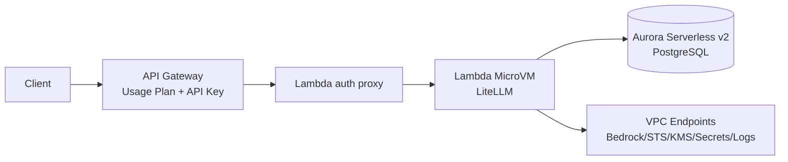
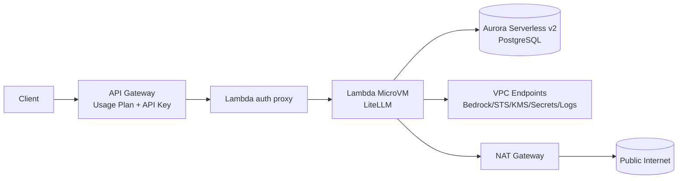
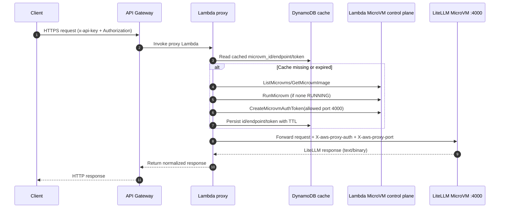

# LiteLLM AWS Lambda MicroVM Serverless

AWS-only deployment of LiteLLM on Lambda MicroVM with Aurora Serverless v2, API Gateway, and CDK.

## Architecture

`Client -> API Gateway (usage plan + API key) -> Lambda proxy -> Lambda MicroVM (LiteLLM) -> Aurora + Bedrock`

### Mode 1: `publicMicrovm=true` (default, no NAT)



### Mode 2: `publicMicrovm=false` (private mode with NAT)



Key design choices:

- `publicMicrovm=true` (default): MicroVM connector subnets are public, NAT = `0`, DB remains private.
- Aurora is always in isolated private DB subnets.
- Runtime MicroVM egress uses a VPC connector so LiteLLM can always reach Aurora.
- Private AWS service access is through VPC endpoints (Bedrock, STS, KMS, Secrets Manager, CloudWatch Logs, S3 gateway).

## Mode comparison table (security + cost)

| Dimension | `publicMicrovm=true` (default) | `publicMicrovm=false` (private mode) | Security / cost impact |
|---|---|---|---|
| MicroVM connector subnet | `AppPublic` | `AppPrivate` (`PRIVATE_WITH_EGRESS`) | Private mode reduces direct network exposure surface for connector ENIs. |
| NAT gateway | None (`natGateways: 0`) | One NAT (`natGateways: 1`) | Public mode has lower fixed baseline cost; private mode adds steady NAT cost. |
| Aurora subnet | `DbPrivate` isolated | `DbPrivate` isolated | Same DB isolation in both modes. |
| Aurora reachability from MicroVM | Via VPC egress connector + SG allow 5432 from connector SG | Same | Same security posture for DB path. |
| Private AWS service access | Interface VPC endpoints + S3 gateway endpoint | Same | Keeps Bedrock/STS/KMS/Secrets/Logs on private VPC endpoint paths in both modes. |
| Public internet path from MicroVM runtime | Not the intended default path in this mode | Available through NAT from private subnets | Private mode supports controlled outbound internet dependency; public mode is optimized for private targets. |
| API ingress/auth layers | API Gateway `x-api-key` + LiteLLM `Authorization` bearer key | Same | Same application/API auth posture across modes. |
| Operational complexity | Lower (no NAT routing/cost management) | Higher (NAT lifecycle and routing to maintain) | Public mode is simpler; private mode is stricter network posture with extra ops/cost overhead. |
| Main cost drivers beyond networking | Bedrock inference, Aurora ACU/storage, API/Lambda/Logs traffic | Same + NAT baseline | Workload costs are similar; mode choice mainly changes networking baseline and outbound behavior. |

### Which mode to choose

- Choose **`publicMicrovm=true`** when your runtime path is mainly private AWS targets (Aurora + VPC endpoints) and you want the lowest fixed baseline cost.
- Choose **`publicMicrovm=false`** when you need consistent outbound internet egress from runtime and prefer private connector subnet placement even with higher baseline cost.

## What this stack creates

- VPC and subnets:
  - `publicMicrovm=true`: `AppPublic` + `DbPrivate`
  - `publicMicrovm=false`: `AppPublic` + `AppPrivate` + `DbPrivate` (includes NAT)
- Aurora PostgreSQL Serverless v2 (`min ACU 0`, `max ACU 2`)
- Lambda MicroVM image resource (`AWS::Lambda::MicrovmImage`) and runtime settings
- API Gateway REST API with:
  - required API key (`x-api-key`)
  - binary media types enabled (`*/*`)
  - public and admin usage plans
- Lambda proxy that:
  - auto-discovers/starts MicroVM
  - creates MicroVM auth token
  - injects `X-aws-proxy-auth` and `X-aws-proxy-port`
  - preserves text/binary responses correctly
- Secrets Manager secrets for:
  - API Gateway key (`AwsGatewayApiKeySecretArn`)
  - LiteLLM master key parts (`LiteLlmMasterKeySecretArn`, `prefix + suffix`)
- DynamoDB TTL cache table for MicroVM/token proxy state
- ECR + CodeBuild project for ARM64 LiteLLM base image mirroring

## Operational findings (important)

- **No NAT in default mode:** `publicMicrovm=true` sets `natGateways: 0`.
- **DB is private while MicroVM can be public subnet-attached:** supported in this stack.
- **Proxy concurrency bottleneck fixed:** reserved concurrency is `50` (was too low for UI asset fan-out).
- **API throttling tuned:** public and admin usage plans have higher burst/rate for practical use.
- **Static assets stability:** API Gateway binary media types + proxy binary-safe forwarding avoid UI asset corruption/500s.
- **Auth bug fixed in key script:** `/key/generate` now sends real Bearer master key in `Authorization`.
- **Missing IAM fixed:** proxy role includes `lambda:GetMicrovmImage` and `lambda:TerminateMicrovm`.
- **Log retention standardized:** MicroVM runtime logs, proxy Lambda logs, API Gateway access/execution logs are `7 days`.
- **Direct admin access path works:** local connector script reaches MicroVM directly and serves `/ui`.
- **API Gateway key reuse constraint:** a single API key cannot be attached to multiple usage plans on the same stage.

## Lambda proxy call interaction



## Deploy

```bash
cd infra/cdk
npm install
npm run build
npx cdk deploy PrivateLiteLlmMicrovmStack --require-approval never -c microvmRegion=us-east-1 -c publicMicrovm=true
```

Private-mode deployment (NAT enabled):

```bash
npx cdk deploy PrivateLiteLlmMicrovmStack --require-approval never -c microvmRegion=us-east-1 -c publicMicrovm=false
```

Optional base-image modes:

```bash
# use mirrored private ECR base image (after starting CodeBuild mirror project)
npx cdk deploy PrivateLiteLlmMicrovmStack -c microvmRegion=us-east-1 -c useCodebuildEcrBaseImage=true

# force explicit base image
npx cdk deploy PrivateLiteLlmMicrovmStack -c microvmRegion=us-east-1 -c microvmContainerBaseImage=<account>.dkr.ecr.<region>.amazonaws.com/<repo>:<tag>
```

## Auth model (two layers)

Every API request requires both:

1. API Gateway key in header `x-api-key`
2. LiteLLM key in header `Authorization: Bearer <litellm-key>`

Relevant stack outputs:

- `PublicApiInvokeUrl`
- `AwsGatewayApiKeySecretArn`
- `LiteLlmMasterKeySecretArn`
- `AwsGatewayUsagePlanId` (client/public)
- `AwsGatewayAdminUsagePlanId` (admin/browser)

Fetch secrets:

```bash
API_KEY_JSON=$(aws secretsmanager get-secret-value --secret-id <AwsGatewayApiKeySecretArn> --query SecretString --output text)
MASTER_JSON=$(aws secretsmanager get-secret-value --secret-id <LiteLlmMasterKeySecretArn> --query SecretString --output text)
```

## Script reference (detailed)

### `infra/cdk/scripts/create-api-key.sh`

Purpose:

- Generates one LiteLLM user key and registers the same value in API Gateway usage plan.
- Pulls required stack outputs and secrets automatically.
- Saves key to local file for reuse.

Required IAM permissions:

- `cloudformation:DescribeStacks`
- `secretsmanager:GetSecretValue`
- `apigateway:CreateApiKey`
- `apigateway:CreateUsagePlanKey`

Arguments:

| Flag | Required | Description |
|---|---|---|
| `--alias` | no | Key alias (`default: user-key`) |
| `--duration` | no | LiteLLM key duration (`default: 24h`) |
| `--models` | no | Comma-separated model allowlist |
| `--usage-plan` | no | `public` or `admin` (`default: public`) |
| `--key` | no | Use explicit key value instead of random generation |
| `--output-file` | no | Output path (`default: .keys/<alias>.txt`) |
| `--json` | no | Print full API response JSON instead of key only |
| `--stack` | no | CloudFormation stack name override |
| `--region` | no | AWS region override |

Examples:

```bash
cd infra/cdk
./scripts/create-api-key.sh --alias team-a --duration 7d --models nova-2-lite
./scripts/create-api-key.sh --alias admin-ui --duration 7d --usage-plan admin
./scripts/create-api-key.sh --alias ci --duration 24h --output-file .keys/ci.txt
```

Expected output:

- `Attached key to usage plan scope: <public|admin>`
- `Saved generated key to: <path>`
- final line is generated key (unless `--json` is used)

Validation rules / fail-fast behavior:

- No fallback behavior.
- Key must start with `sk-`.
- Key length must be `20-128` (API Gateway limit).
- Script fails if `/key/generate` does not return the exact requested key.

### `infra/cdk/scripts/connect-admin-ui.sh`

Purpose:

- Opens local browser access to LiteLLM admin UI through direct MicroVM connection.
- Does not use API Gateway for UI transport.
- Prints LiteLLM master key for web login.

Required IAM permissions:

- `cloudformation:DescribeStacks`
- `cloudformation:DescribeStackResource`
- `lambda:GetFunctionConfiguration`
- `lambda-microvms:ListMicrovms`
- `lambda-microvms:GetMicrovm`
- `lambda-microvms:RunMicrovm` (unless existing RUNNING microVM is found)
- `lambda-microvms:CreateMicrovmAuthToken`
- `secretsmanager:GetSecretValue`

Arguments:

| Flag | Required | Description |
|---|---|---|
| `--port` | no | Local listen port (`default: 8787`) |
| `--microvm-port` | no | Upstream app port on microVM (`default: 4000`) |
| `--token-minutes` | no | Auth token TTL minutes (`default: 60`) |
| `--no-start` | no | Fail if no RUNNING microVM exists |
| `--stack` | no | CloudFormation stack name override |
| `--region` | no | AWS region override |

Run:

```bash
cd infra/cdk
./scripts/connect-admin-ui.sh
```

Expected output:

- `MicroVM ID: ...`
- `MicroVM endpoint: ...`
- `Local admin proxy: http://127.0.0.1:8787/ui`
- `LiteLLM admin login key: ...`

Then open `http://127.0.0.1:8787/ui` and login with printed master key.

Direct-microVM reachability note:

- with `ALL_INGRESS`, endpoint is directly reachable
- with private ingress policy, you need private network path (VPN/peering/bastion)

### `infra/cdk/scripts/destroy-stack.sh`

Purpose:

- Destroys the CDK stack using the same context pattern (`microvmRegion`, `publicMicrovm`).

Environment overrides:

| Variable | Default | Description |
|---|---|---|
| `STACK_NAME` | `PrivateLiteLlmMicrovmStack` | Stack to destroy |
| `MICROVM_REGION` | `us-east-1` (or `CDK_DEFAULT_REGION`) | microVM region context |
| `PUBLIC_MICROVM` | `true` | mode context passed to CDK |

Run:

```bash
cd infra/cdk
./scripts/destroy-stack.sh
```

## API user guide (end-to-end)

### 1) Load endpoint and keys from stack outputs/secrets

```bash
STACK_NAME=PrivateLiteLlmMicrovmStack
AWS_REGION=us-east-1

PUBLIC_API_URL=$(aws cloudformation describe-stacks \
  --stack-name "$STACK_NAME" --region "$AWS_REGION" \
  --query "Stacks[0].Outputs[?OutputKey=='PublicApiInvokeUrl'].OutputValue" --output text)

API_KEY_SECRET_ARN=$(aws cloudformation describe-stacks \
  --stack-name "$STACK_NAME" --region "$AWS_REGION" \
  --query "Stacks[0].Outputs[?OutputKey=='AwsGatewayApiKeySecretArn'].OutputValue" --output text)

MASTER_KEY_SECRET_ARN=$(aws cloudformation describe-stacks \
  --stack-name "$STACK_NAME" --region "$AWS_REGION" \
  --query "Stacks[0].Outputs[?OutputKey=='LiteLlmMasterKeySecretArn'].OutputValue" --output text)

API_KEY_JSON=$(aws secretsmanager get-secret-value --region "$AWS_REGION" --secret-id "$API_KEY_SECRET_ARN" --query SecretString --output text)
MASTER_JSON=$(aws secretsmanager get-secret-value --region "$AWS_REGION" --secret-id "$MASTER_KEY_SECRET_ARN" --query SecretString --output text)

API_GATEWAY_KEY=$(python - <<'PY' "$API_KEY_JSON"
import json,sys
print(json.loads(sys.argv[1])["apiKey"])
PY
)

LITELLM_MASTER_KEY=$(python - <<'PY' "$MASTER_JSON"
import json,sys
v=json.loads(sys.argv[1]); print((v.get("prefix") or "") + (v.get("suffix") or ""))
PY
)
```

### 2) Liveness check

```bash
curl -sS "${PUBLIC_API_URL%/}/health/liveliness" \
  -H "x-api-key: $API_GATEWAY_KEY" \
  -H "Authorization: Bearer $LITELLM_MASTER_KEY"
```

### 3) Create a user key (recommended via script)

```bash
cd infra/cdk
./scripts/create-api-key.sh --alias app-user --duration 7d --models nova-2-lite
USER_KEY=$(cat .keys/app-user.txt)
```

Manual `/key/generate` call (if needed):

```bash
curl -sS -X POST "${PUBLIC_API_URL%/}/key/generate" \
  -H "x-api-key: $API_GATEWAY_KEY" \
  -H "Authorization: Bearer $LITELLM_MASTER_KEY" \
  -H "Content-Type: application/json" \
  --data-raw '{"key_alias":"manual-user","duration":"24h"}'
```

### 4) Call chat completions with user key

```bash
curl -sS -X POST "${PUBLIC_API_URL%/}/chat/completions" \
  -H "x-api-key: $API_GATEWAY_KEY" \
  -H "Authorization: Bearer $USER_KEY" \
  -H "Content-Type: application/json" \
  --data-raw '{
    "model":"nova-2-lite",
    "messages":[{"role":"user","content":"hello"}]
  }'
```

### 5) Common errors

| Symptom | Typical cause | Action |
|---|---|---|
| `403 Forbidden` from API Gateway | missing/invalid `x-api-key` | confirm `AwsGatewayApiKeySecretArn` value and header |
| `401` from LiteLLM endpoints | missing/invalid Authorization bearer header | use master key for admin endpoints or valid generated user key |
| `429` | usage-plan throttle/quota exceeded | use admin/public key on correct usage plan, then retry |
| `500/502` on first requests | microVM startup/token lifecycle in progress | retry request; check proxy and microVM logs |

## API and logging behavior

- API Gateway:
  - stage: `prod`
  - logging level: `ERROR`
  - access logs enabled (JSON format)
  - execution logs retained for 7 days
- Lambda proxy logs retained for 7 days
- MicroVM runtime logs (`/aws/lambda-microvms/<image-name>`) retained for 7 days

## MicroVM runtime settings (LiteLLM fit)

- minimum memory in image config: `2048 MiB`
- idle policy:
  - `maxIdleDurationSeconds = 900`
  - `suspendedDurationSeconds = 28800`
- maximum duration:
  - `maximumDurationInSeconds = 28800`

## Cost behavior summary

- Default mode avoids NAT cost (`publicMicrovm=true`).
- Main cost drivers are typically:
  - model inference (Bedrock)
  - Aurora compute/storage
- API Gateway/Lambda/CloudWatch costs are usually smaller unless high sustained traffic.

## Known deployment caveat

`AWS::Lambda::MicrovmImage` can occasionally fail CloudFormation stabilization (`NotStabilized`) even when a newer version later becomes active.

Practical workaround:

1. Retry `cdk deploy` for image stabilization races.
2. Verify latest MicroVM image/runtime logs in CloudWatch.
3. Keep infra/network/database changes separate from image retries.

## Repository layout

```text
infra/cdk/
  bin/
  lib/
  lambda/
  microvm-image/
  scripts/
    create-api-key.sh
    connect-admin-ui.sh
    destroy-stack.sh
```

## Destroy

```bash
cd infra/cdk
./scripts/destroy-stack.sh
```
