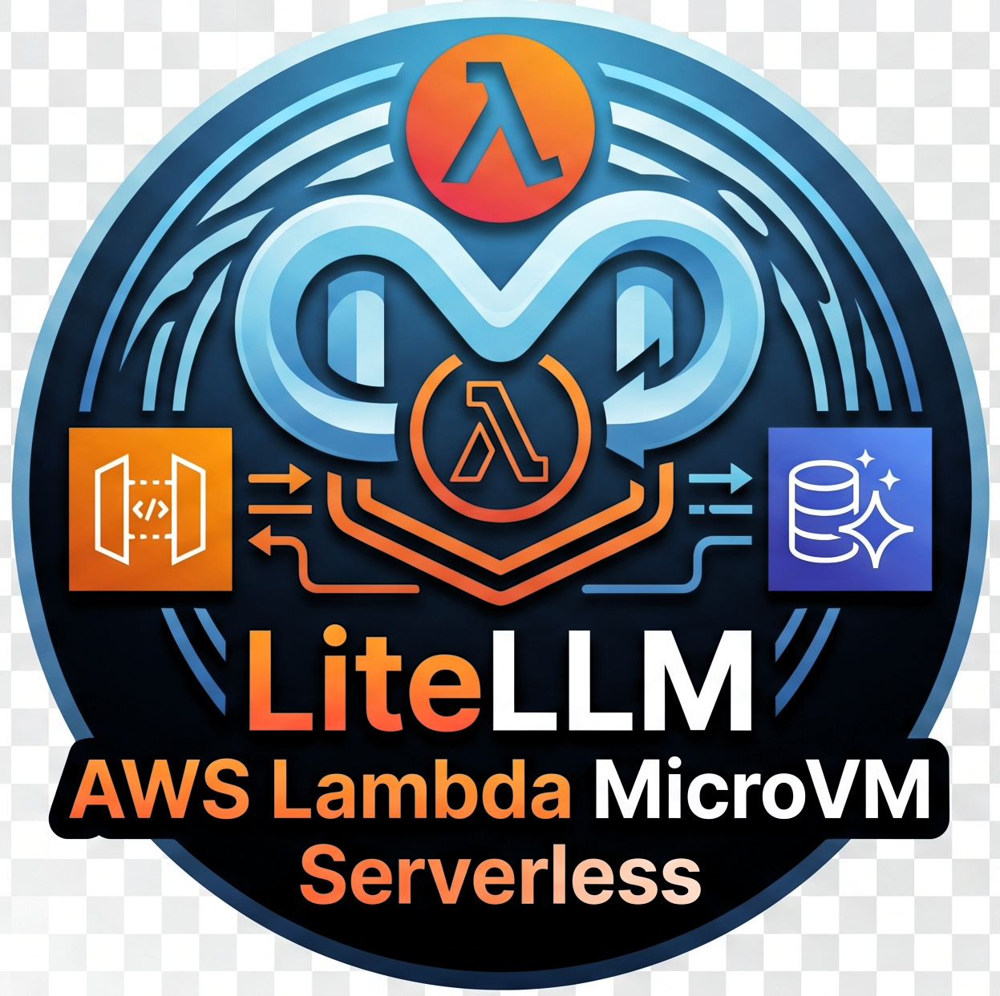

# LiteLLM AWS Lambda MicroVM Serverless

<p align="center">
  
</p>

Run LiteLLM on AWS with Lambda MicroVMs, Aurora Serverless v2, API Gateway, and CDK.

This stack is built for teams that want a private, serverless LLM gateway with:
- LiteLLM as the model router and auth layer
- Lambda MicroVMs for model execution
- Aurora Serverless v2 for persistence
- API Gateway for public access control and usage plans

## Documentation

- [CDK Design](docs/cdk-design.md)
- [Deployment Guide](docs/deployment.md)
- [Authentication and Keys](docs/auth-and-keys.md) (includes IAM -> LiteLLM key flow diagram)
- [Testing Guide](docs/testing.md)
- [API Usage Guide](docs/api-usage.md)
- [Troubleshooting Guide](docs/troubleshooting.md)
- [Documentation Map](docs/documentation-map.md)

## Tables

- Mode comparison table (security/cost): `docs/cdk-design.md` -> **Mode comparison table (security + cost)**
- Deploy script flags table: `docs/deployment.md` -> **scripts/deploy-stack.sh**
- Client API key script flags table: `docs/deployment.md` -> **scripts/create-client-key.sh**
- API key script flags table: `docs/deployment.md` -> **scripts/create-api-key.sh**
- Common failures table: `docs/api-usage.md` -> **Common failures**
- Troubleshooting matrix: `docs/troubleshooting.md` -> **Common failure patterns**

## Quick Start

```bash
cd infra/cdk
./scripts/deploy-stack.sh --config cdk-settings.yaml --stack PrivateLiteLlmMicrovmStack
```

Generate a client key (non-admin, LLM inference only):

```bash
# From repo root:
./scripts/create-client-key.sh --alias app-user --max-budget 10 --budget-duration 1d

# Or from infra/cdk:
cd infra/cdk
./scripts/create-client-key.sh --alias app-user --max-budget 10 --budget-duration 1d
```

The script automatically detects the public usage plan, enforces non-admin key type (`llm_api`), and prints the client key, endpoint, and ready-to-use cURL/OpenAI SDK examples.

