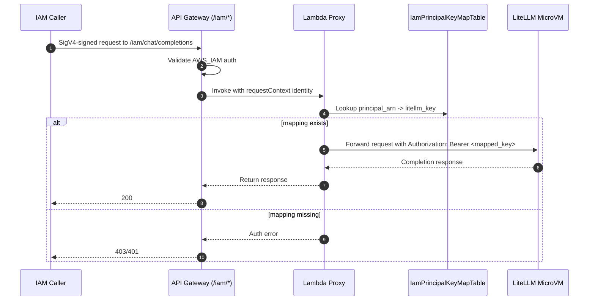

# Authentication and Keys

## Two-layer auth model

Every normal request must pass both:

1. `x-api-key` (API Gateway usage plan key)
2. `Authorization: Bearer <litellm-user-key>` (LiteLLM virtual key)

`LITELLM_MASTER_KEY` is for admin operations (for example `/key/generate`), not for client inference traffic.

## Create a non-admin app key

Use:

- `infra/cdk/scripts/create-api-key.sh`

Key features:

- Registers the same key value in LiteLLM + API Gateway usage plan
- Supports budget limits and key type

Example (LLM-only key, US$10 daily cap):

```bash
cd infra/cdk
PUBLIC_PLAN_ID=$(aws cloudformation describe-stacks --stack-name PrivateLiteLlmMicrovmStack --region us-east-1 --query "Stacks[0].Outputs[?OutputKey=='AwsGatewayUsagePlanId'].OutputValue" --output text)

./scripts/create-api-key.sh \
  --usage-plan-id "$PUBLIC_PLAN_ID" \
  --alias app-user \
  --max-budget 10 \
  --budget-duration 1d \
  --key-type llm_api \
  --output-file .keys/user-key.txt
```

## IAM path (`/iam/*`)

IAM route is a separate auth path:

- API Gateway `AWS_IAM` authorization (SigV4)
- Proxy maps IAM principal ARN to LiteLLM key from DynamoDB
- No `x-api-key` usage-plan check on `/iam/*` routes

Helper scripts:

- `scripts/create-iam-key-mapping.sh`
- `scripts/call-iam-endpoint.sh`

Relevant stack outputs:

- `PublicApiInvokeUrl`
- `AwsGatewayApiKeySecretArn`
- `LiteLlmMasterKeySecretArn`
- `AwsGatewayUsagePlanId`
- `AwsGatewayAdminUsagePlanId`
- `IamRouteCallerRoleArn`

## IAM -> LiteLLM key flow (diagram)



## IAM mapping lifecycle

1. Create mapping key with `scripts/create-iam-key-mapping.sh` (or CDK bootstrap default mapping).
2. Script generates a LiteLLM key via `/key/generate`.
3. Script stores `{ principal_arn -> litellm_key }` in `IamPrincipalKeyMapTable`.
4. Runtime IAM requests on `/iam/*` are authorized by API Gateway IAM auth, then translated to LiteLLM bearer key by proxy.

Notes:

- This path is independent from public-route usage-plan keys.
- `LITELLM_MASTER_KEY` is only used for admin key generation/bootstrap, not client inference.

## OpenClaw settings (exact fields)

Use the existing OpenAI-compatible path (`/...`):

1. Open OpenClaw **Settings** -> **Models** -> **Providers**.
2. Add or edit provider id `litellm`.
3. Set `baseUrl` to `https://<api-id>.execute-api.<region>.amazonaws.com/prod/`.
4. Set `api` to `openai-completions`.
5. Set `apiKey` to your generated user key (`sk-...`).
6. Add custom header `x-api-key` with the same key value.
7. Select model id from this stack (for example `nova-2-lite`).

Provider example:

```json
{
  "litellm": {
    "baseUrl": "https://<api-id>.execute-api.<region>.amazonaws.com/prod/",
    "apiKey": "sk-<user-key>",
    "api": "openai-completions",
    "headers": {
      "x-api-key": "sk-<user-key>"
    },
    "models": [
      { "id": "nova-2-lite", "name": "nova-2-lite" }
    ]
  }
}
```

## Parallel auth paths (existing + IAM)

- **Existing path (`/...`)**: requires `x-api-key` and LiteLLM `Authorization` header.
- **IAM path (`/iam/...`)**: requires SigV4 IAM auth at API Gateway, then proxy injects mapped LiteLLM key.
- On `/iam/...`, client-supplied API key and bearer headers are not used for app auth decisions.

## Admin UI

Use:

- `scripts/connect-admin-ui.sh`

This is a direct MicroVM path and writes the admin master key into a local file for login.
