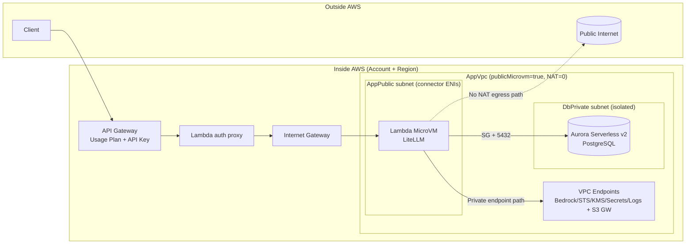
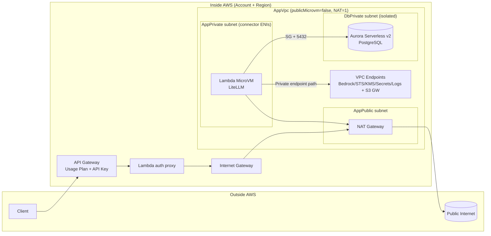
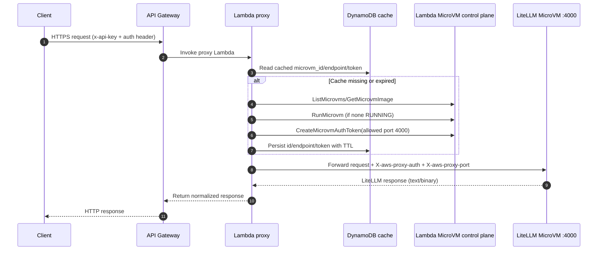

# CDK Design

## High-level architecture

`Client -> API Gateway -> Lambda proxy -> Lambda MicroVM (LiteLLM) -> Aurora`

Core resources:

1. **Edge/API**: API Gateway, usage plans, API key, IAM `/iam/*` route.
2. **Runtime**: Lambda proxy + Lambda MicroVM image/runtime.
3. **Data**: Aurora PostgreSQL, Secrets Manager, DynamoDB tables.
4. **Networking**: VPC, subnets, security groups, VPC endpoints, optional NAT.

## Stack decomposition

The long stack was split into domain modules:

- `infra/cdk/lib/stack/networking.ts`
  - VPC/subnets, connector SG, DB SG, interface endpoints, S3 gateway endpoint.
- `infra/cdk/lib/stack/image-artifacts.ts`
  - Artifact S3 bucket, ECR base repo, CodeBuild mirror project.
- `infra/cdk/lib/microvm-image-source.ts`
  - MicroVM image packaging helpers (Docker base rewrite + `config.yaml` model filtering).
- `infra/cdk/lib/stack/iam-key-bootstrap-code.ts`
  - IAM key bootstrap custom-resource inline Python code.

Main composition remains in:

- `infra/cdk/lib/private-litellm-microvm-stack.ts`

## Network modes

### `publicMicrovm=true` (default)

- App subnet: public
- NAT gateways: `0`
- Lowest baseline cost
- Best for AWS-private dependencies (Aurora + VPC endpoints)

### `publicMicrovm=false`

- App subnet: private-with-egress
- NAT gateways: `1`
- Required for reliable non-AWS internet egress (e.g., Azure/public GCP endpoints)

## Mode comparison table (security + cost)

| Dimension | `publicMicrovm=true` (default) | `publicMicrovm=false` (private mode) | Security / cost impact |
|---|---|---|---|
| MicroVM connector subnet | `AppPublic` | `AppPrivate` (`PRIVATE_WITH_EGRESS`) | Private mode reduces direct network exposure surface for connector ENIs. |
| NAT gateway | None (`natGateways: 0`) | One NAT (`natGateways: 1`) | Public mode has lower fixed baseline cost; private mode adds steady NAT cost. |
| Aurora subnet | `DbPrivate` isolated | `DbPrivate` isolated | Same DB isolation in both modes. |
| Aurora reachability from MicroVM | Via VPC egress connector + SG allow 5432 from connector SG | Same | Same security posture for DB path. |
| Private AWS service access | Interface VPC endpoints + S3 gateway endpoint | Same | Keeps Bedrock/STS/KMS/Secrets/Logs on private VPC endpoint paths in both modes. |
| Public internet path from MicroVM runtime | No (no NAT route for VPC-attached Lambda ENIs) | Yes (private subnet -> NAT -> internet) | `publicMicrovm=true` cannot reliably call non-AWS internet endpoints; use `publicMicrovm=false` for Azure/public GCP model egress. |
| API ingress/auth layers | API Gateway API key + LiteLLM key header | Same | Same application/API auth posture across modes. |
| Operational complexity | Lower (no NAT routing/cost management) | Higher (NAT lifecycle and routing to maintain) | Public mode is simpler; private mode is stricter network posture with extra ops/cost overhead. |
| Main cost drivers beyond networking | Bedrock inference, Aurora ACU/storage, API/Lambda/Logs traffic | Same + NAT baseline | Workload costs are similar; mode choice mainly changes networking baseline and outbound behavior. |

### Which mode to choose

- Choose `publicMicrovm=true` when your runtime path is mainly private AWS targets (Aurora + VPC endpoints) and you want the lowest fixed baseline cost.
- Choose `publicMicrovm=false` when you need consistent outbound internet egress from runtime and prefer private connector subnet placement even with higher baseline cost.

AWS reference: Lambda ENI behavior and internet access  
https://docs.aws.amazon.com/lambda/latest/dg/configuration-vpc-internet.html

## Model source handling

Source model list is:

- `infra/cdk/microvm-image/config.yaml`

At CDK image packaging time:

- `azure/...` models are included only if Azure config is provided.
- `vertex_ai/...` models are included only if Vertex config is provided.

This allows one shared `config.yaml` while supporting provider-optional deployments.

## Auth design

Two-layer auth is intentional:

1. API Gateway layer: `x-api-key`
2. LiteLLM layer: request key in `Authorization` header

`LITELLM_MASTER_KEY` is admin-only (key generation/admin operations), not a client request key.

## DynamoDB design

- `MicrovmProxyCacheTable`: proxy runtime cache/coordination (`microvm_id`, endpoint, token state).
- `IamPrincipalKeyMapTable`: persistent IAM principal -> LiteLLM key mapping for `/iam/*`.

## Lambda proxy call interaction

### Stale-token bug and fix

- Symptom: intermittent `403 Token authentication failed` after MicroVM replacement/rotation.
- Root cause: cached MicroVM auth token could be reused after VM id changed.
- Fix in `infra/cdk/lambda/microvm_proxy.py`:
  - bind cached token to `token_microvm_id`
  - invalidate token when active `microvm_id` changes or cached VM lookup fails
  - persist/load `token_microvm_id` in DynamoDB cache item
