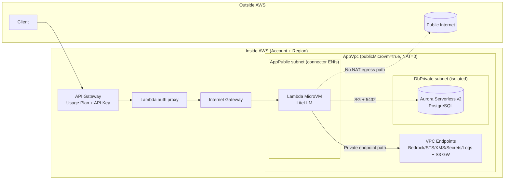
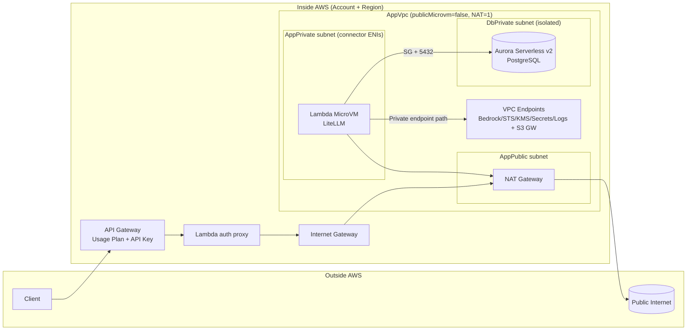
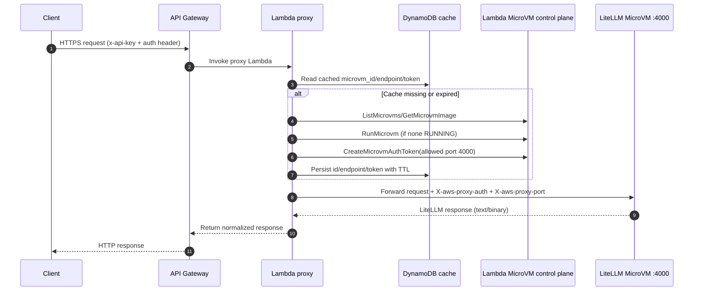
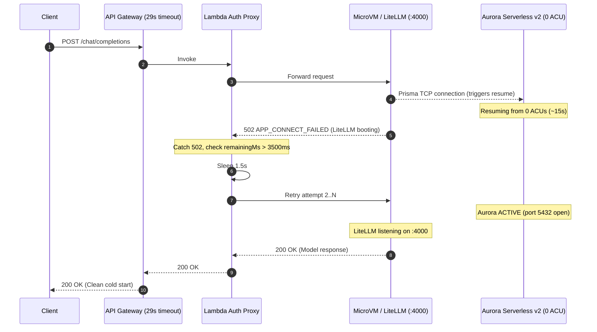

# CDK Design

## High-level architecture

`Client -> API Gateway -> Lambda proxy -> Lambda MicroVM (LiteLLM) -> Aurora`

Core resources:

1. **Edge/API**: API Gateway, usage plans, API key, IAM `/iam/*` route.
2. **Runtime**: Lambda proxy + Lambda MicroVM image/runtime.
3. **Data**: Aurora PostgreSQL, Secrets Manager, DynamoDB tables.
4. **Networking**: VPC, subnets, security groups, VPC endpoints, optional NAT.

## Stack decomposition

The long stack was split into domain modules:

- `infra/cdk/lib/stack/networking.ts`
  - VPC/subnets, connector SG, DB SG, interface endpoints, S3 gateway endpoint.
- `infra/cdk/lib/stack/image-artifacts.ts`
  - Artifact S3 bucket, ECR base repo, CodeBuild mirror project.
- `infra/cdk/lib/microvm-image-source.ts`
  - MicroVM image packaging helpers (Docker base rewrite + `config.yaml` model filtering).
- `infra/cdk/lib/stack/iam-key-bootstrap-code.ts`
  - IAM key bootstrap custom-resource inline Python code.

Main composition remains in:

- `infra/cdk/lib/private-litellm-microvm-stack.ts`

## Network modes

### `publicMicrovm=true` (default)

- App subnet: public
- NAT gateways: `0`
- Lowest baseline cost
- Best for AWS-private dependencies (Aurora + VPC endpoints)


```mermaid
flowchart LR
  subgraph OUT1["Outside AWS"]
    C[Client]
    Internet[(Public Internet)]
  end

  subgraph AWS1["Inside AWS (Account + Region)"]
    APIGW[API Gateway<br/>Usage Plan + API Key]
    Proxy[Lambda auth proxy]
    IGW[Internet Gateway]

    subgraph VPC1["AppVpc (publicMicrovm=true, NAT=0)"]
      subgraph APPPUB["AppPublic subnet (connector ENIs)"]
        MicroVM[Lambda MicroVM<br/>LiteLLM]
      end
      subgraph DBPRIV1["DbPrivate subnet (isolated)"]
        Aurora[(Aurora Serverless v2<br/>PostgreSQL)]
      end
      VPCE[VPC Endpoints<br/>Bedrock/STS/KMS/Secrets/Logs + S3 GW]
    end
  end

  C --> APIGW --> Proxy --> IGW
  IGW --> MicroVM
  MicroVM -->|SG + 5432| Aurora
  MicroVM -->|Private endpoint path| VPCE
  MicroVM -.->|No NAT egress path| Internet
```

### `publicMicrovm=false`

- App subnet: private-with-egress
- NAT gateways: `1`
- Required for reliable non-AWS internet egress (e.g., Azure/public GCP endpoints)


```mermaid
flowchart LR
  subgraph OUT2["Outside AWS"]
    C[Client]
    Internet[(Public Internet)]
  end

  subgraph AWS2["Inside AWS (Account + Region)"]
    APIGW[API Gateway<br/>Usage Plan + API Key]
    Proxy[Lambda auth proxy]
    IGW[Internet Gateway]

    subgraph VPC2["AppVpc (publicMicrovm=false, NAT=1)"]
      subgraph APPPRIV["AppPrivate subnet (connector ENIs)"]
        MicroVM[Lambda MicroVM<br/>LiteLLM]
      end
      subgraph APPPUB2["AppPublic subnet"]
        NAT[NAT Gateway]
      end
      subgraph DBPRIV2["DbPrivate subnet (isolated)"]
        Aurora[(Aurora Serverless v2<br/>PostgreSQL)]
      end
      VPCE[VPC Endpoints<br/>Bedrock/STS/KMS/Secrets/Logs + S3 GW]
    end
  end

  C --> APIGW --> Proxy --> IGW
  IGW --> NAT
  MicroVM -->|SG + 5432| Aurora
  MicroVM -->|Private endpoint path| VPCE
  MicroVM --> NAT --> Internet
```

## Mode comparison table (security + cost)

| Dimension | `publicMicrovm=true` (default) | `publicMicrovm=false` (private mode) | Security / cost impact |
|---|---|---|---|
| MicroVM connector subnet | `AppPublic` | `AppPrivate` (`PRIVATE_WITH_EGRESS`) | Private mode reduces direct network exposure surface for connector ENIs. |
| NAT gateway | None (`natGateways: 0`) | One NAT (`natGateways: 1`) | Public mode has lower fixed baseline cost; private mode adds steady NAT cost. |
| Aurora subnet | `DbPrivate` isolated | `DbPrivate` isolated | Same DB isolation in both modes. |
| Aurora reachability from MicroVM | Via VPC egress connector + SG allow 5432 from connector SG | Same | Same security posture for DB path. |
| Private AWS service access | Interface VPC endpoints + S3 gateway endpoint | Same | Keeps Bedrock/STS/KMS/Secrets/Logs on private VPC endpoint paths in both modes. |
| Public internet path from MicroVM runtime | No (no NAT route for VPC-attached Lambda ENIs) | Yes (private subnet -> NAT -> internet) | `publicMicrovm=true` cannot reliably call non-AWS internet endpoints; use `publicMicrovm=false` for Azure/public GCP model egress. |
| API ingress/auth layers | API Gateway API key + LiteLLM key header | Same | Same application/API auth posture across modes. |
| Operational complexity | Lower (no NAT routing/cost management) | Higher (NAT lifecycle and routing to maintain) | Public mode is simpler; private mode is stricter network posture with extra ops/cost overhead. |
| Main cost drivers beyond networking | Bedrock inference, Aurora ACU/storage, API/Lambda/Logs traffic | Same + NAT baseline | Workload costs are similar; mode choice mainly changes networking baseline and outbound behavior. |

### Which mode to choose

- Choose `publicMicrovm=true` when your runtime path is mainly private AWS targets (Aurora + VPC endpoints) and you want the lowest fixed baseline cost.
- Choose `publicMicrovm=false` when you need consistent outbound internet egress from runtime and prefer private connector subnet placement even with higher baseline cost.

AWS reference: Lambda ENI behavior and internet access  
https://docs.aws.amazon.com/lambda/latest/dg/configuration-vpc-internet.html

## Model source handling

Source model list is:

- `infra/cdk/microvm-image/config.yaml`

At CDK image packaging time:

- `azure/...` models are included only if Azure config is provided.
- `vertex_ai/...` models are included only if Vertex config is provided.

This allows one shared `config.yaml` while supporting provider-optional deployments.

## Auth design

Two-layer auth is intentional:

1. API Gateway layer: `x-api-key`
2. LiteLLM layer: request key in `Authorization` header

`LITELLM_MASTER_KEY` is admin-only (key generation/admin operations), not a client request key.

## DynamoDB design

- `MicrovmProxyCacheTable`: proxy runtime cache/coordination (`microvm_id`, endpoint, token state).
- `IamPrincipalKeyMapTable`: persistent IAM principal -> LiteLLM key mapping for `/iam/*`.

## Lambda proxy call interaction


```mermaid
sequenceDiagram
  autonumber
  participant Client
  participant APIGW as API Gateway
  participant Proxy as Lambda proxy
  participant DDB as DynamoDB cache
  participant MicroCtl as Lambda MicroVM control plane
  participant MicroVM as LiteLLM MicroVM :4000

  Client->>APIGW: HTTPS request (x-api-key + auth header)
  APIGW->>Proxy: Invoke proxy Lambda
  Proxy->>DDB: Read cached microvm_id/endpoint/token
  alt Cache missing or expired
    Proxy->>MicroCtl: ListMicrovms/GetMicrovmImage
    Proxy->>MicroCtl: RunMicrovm (if none RUNNING)
    Proxy->>MicroCtl: CreateMicrovmAuthToken(allowed port 4000)
    Proxy->>DDB: Persist id/endpoint/token with TTL
  end
  Proxy->>MicroVM: Forward request + X-aws-proxy-auth + X-aws-proxy-port
  MicroVM-->>Proxy: LiteLLM response (text/binary)
  Proxy-->>APIGW: Return normalized response
  APIGW-->>Client: HTTP response
```

### Stale-token bug and fix

- Symptom: intermittent `403 Token authentication failed` after MicroVM replacement/rotation.
- Root cause: cached MicroVM auth token could be reused after VM id changed.
- Fix in `infra/cdk/lambda/microvm_proxy.py`:
  - bind cached token to `token_microvm_id`
  - invalidate token when active `microvm_id` changes or cached VM lookup fails
  - persist/load `token_microvm_id` in DynamoDB cache item

## Aurora Serverless v2 scale-to-zero (`minCapacity: 0`)

The database cluster is configured with `serverlessV2MinCapacity: 0`:

```typescript
writer: rds.ClusterInstance.serverlessV2("writer"),
serverlessV2MinCapacity: 0,
serverlessV2MaxCapacity: 2,
```

### Cost benefits

- **Idle compute cost**: **$0.00 / hr** when auto-paused.
- **Inactivity threshold**: Auto-pauses after 300 seconds (5 minutes) of 0 active connections.
- **Monthly savings**: Saves ~$43.80/month compared to keeping a baseline 0.5 ACU ($0.12/ACU-hr).
- **RDS Proxy consideration**: RDS Proxy is intentionally **not** used because proxy connection pools maintain continuous heartbeat connections that prevent Aurora from auto-pausing.

### Cold-start resume latency & connection timeouts

When Aurora is paused at 0 ACUs, the first incoming TCP connection triggers an automatic resume:

- **Resume duration**: ~12 – 18 seconds before PostgreSQL accepts TCP connections.
- **Prisma timeout configuration**: Prisma's default connection timeout is only 5 seconds, which would prematurely fail with `P1001: Can't reach database server`.
- **Database URL fix**: The connection string in `private-litellm-microvm-stack.ts` explicitly configures:
  ```text
  :5432/litellm?sslmode=prefer&connect_timeout=30&pool_timeout=30
  ```
  This ensures the database driver waits up to 30 seconds for Aurora to resume before timing out.

## Cold-start handling & proxy retry loop

When a request arrives during a cold start (both MicroVM and Aurora are suspended/idle):

1. **MicroVM hypervisor boots**: ~2 – 3 seconds.
2. **Aurora resumes**: ~12 – 18 seconds.
3. **Prisma migration verification & LiteLLM uvicorn startup**: ~3 – 4 seconds.
4. **Total cold start latency**: ~20 – 24 seconds.

### The `502 APP_CONNECT_FAILED` problem

While LiteLLM is starting inside the container, the Firecracker microVM router responds with `HTTP 502` and `x-aws-proxy-error: APP_CONNECT_FAILED` because port 4000 is not yet bound by uvicorn.

### The proxy retry loop

In `infra/cdk/lambda/microvm_proxy.py`:

- The proxy inspects `context.get_remaining_time_in_millis()`.
- If an upstream `502 APP_CONNECT_FAILED` or connection `URLError` occurs and remaining Lambda time is greater than 3,500 ms, the proxy sleeps for 1.5 seconds and retries (up to 20 attempts).
- This absorbs the entire cold-start window transparently, returning a `200 OK` to the client on the very first request without exposing 502 errors.
- The standard API Gateway integration timeout is 29 seconds (which can be increased up to 300 seconds via AWS Service Quotas for Regional/Private REST APIs if needed).


```mermaid
sequenceDiagram
  autonumber
  participant Client
  participant APIGW as API Gateway (29s timeout)
  participant Proxy as Lambda Auth Proxy
  participant MicroVM as MicroVM / LiteLLM (:4000)
  participant Aurora as Aurora Serverless v2 (0 ACU)

  Client->>APIGW: POST /chat/completions
  APIGW->>Proxy: Invoke
  Proxy->>MicroVM: Forward request
  MicroVM-->>Aurora: Prisma TCP connection (triggers resume)
  Note over Aurora: Resuming from 0 ACUs (~15s)
  MicroVM-->>Proxy: 502 APP_CONNECT_FAILED (LiteLLM booting)
  Note over Proxy: Catch 502, check remainingMs > 3500ms
  Proxy->>Proxy: Sleep 1.5s
  Proxy->>MicroVM: Retry attempt 2..N
  Note over Aurora: Aurora ACTIVE (port 5432 open)
  Note over MicroVM: LiteLLM listening on :4000
  MicroVM-->>Proxy: 200 OK (Model response)
  Proxy-->>APIGW: 200 OK
  APIGW-->>Client: 200 OK (Clean cold start)
```

## Build-time vs runtime network isolation

A critical design requirement is separating image build networking from runtime private VPC database networking:

| Lifecycle phase | Network connector used | Purpose |
|---|---|---|
| **Build phase** (`AWS::Lambda::MicrovmImage`) | `imageDefaultEgressConnectorArn` (`ALL_EGRESS`) | Allows AWS Lambda's CloudFormation builder to pull base container images from public registries (`ghcr.io/berriai/litellm-database:main-stable`). |
| **Runtime phase** (`run_microvm()`) | `MICROVM_EGRESS_CONNECTOR_ARN` (Private VPC connector) | Dynamically attached at runtime by `microvm_proxy.py` to route traffic into the VPC to reach Aurora PostgreSQL on private subnet `10.0.5.8:5432`. |

This decoupling ensures fresh CDK deployments synthesize and build container images reliably without encountering network build failures.
