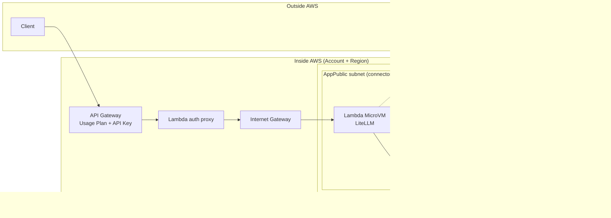
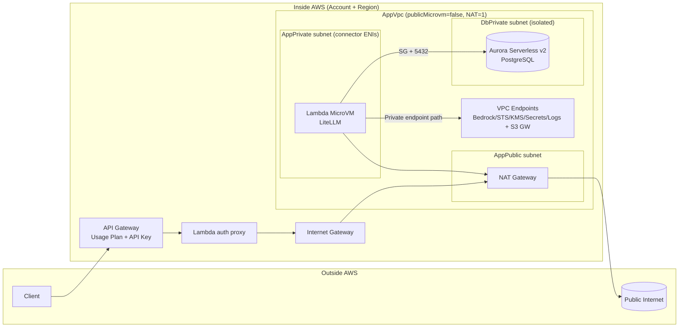
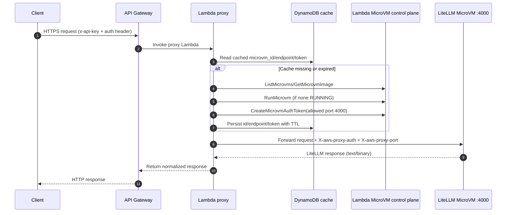
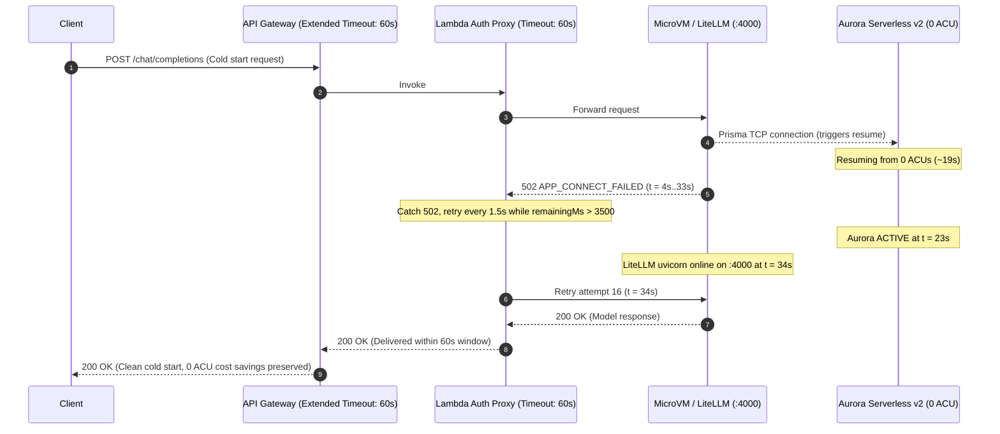
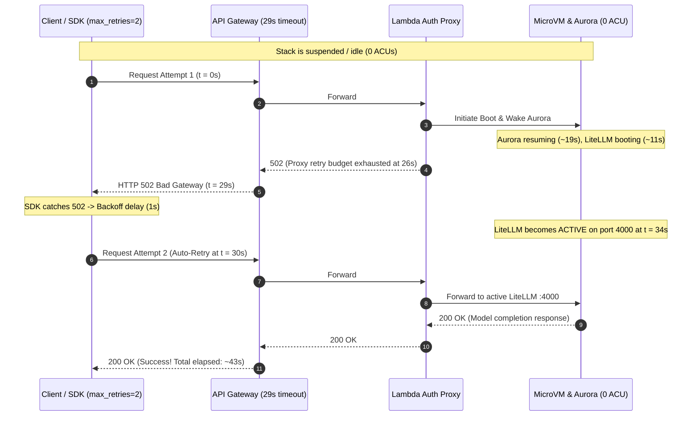

# CDK Design

## High-level architecture

`Client -> API Gateway -> Lambda proxy -> Lambda MicroVM (LiteLLM) -> Aurora`

Core resources:

1. **Edge/API**: API Gateway, usage plans, API key, IAM `/iam/*` route.
2. **Runtime**: Lambda proxy + Lambda MicroVM image/runtime.
3. **Data**: Aurora PostgreSQL, Secrets Manager, DynamoDB tables.
4. **Networking**: VPC, subnets, security groups, VPC endpoints, optional NAT.

## Stack decomposition

The long stack was split into domain modules:

- `infra/cdk/lib/stack/networking.ts`
  - VPC/subnets, connector SG, DB SG, interface endpoints, S3 gateway endpoint.
- `infra/cdk/lib/stack/image-artifacts.ts`
  - Artifact S3 bucket, ECR base repo, CodeBuild mirror project.
- `infra/cdk/lib/microvm-image-source.ts`
  - MicroVM image packaging helpers (Docker base rewrite + `config.yaml` model filtering).
- `infra/cdk/lib/stack/iam-key-bootstrap-code.ts`
  - IAM key bootstrap custom-resource inline Python code.

Main composition remains in:

- `infra/cdk/lib/private-litellm-microvm-stack.ts`

## Network modes

### `publicMicrovm=true` (default)

- App subnet: public
- NAT gateways: `0`
- Lowest baseline cost
- Best for AWS-private dependencies (Aurora + VPC endpoints)


```mermaid
flowchart LR
  subgraph OUT1["Outside AWS"]
    C[Client]
    Internet[(Public Internet)]
  end

  subgraph AWS1["Inside AWS (Account + Region)"]
    APIGW[API Gateway<br/>Usage Plan + API Key]
    Proxy[Lambda auth proxy]
    IGW[Internet Gateway]

    subgraph VPC1["AppVpc (publicMicrovm=true, NAT=0)"]
      subgraph APPPUB["AppPublic subnet (connector ENIs)"]
        MicroVM[Lambda MicroVM<br/>LiteLLM]
      end
      subgraph DBPRIV1["DbPrivate subnet (isolated)"]
        Aurora[(Aurora Serverless v2<br/>PostgreSQL)]
      end
      VPCE[VPC Endpoints<br/>Bedrock/STS/KMS/Secrets/Logs + S3 GW]
    end
  end

  C --> APIGW --> Proxy --> IGW
  IGW --> MicroVM
  MicroVM -->|SG + 5432| Aurora
  MicroVM -->|Private endpoint path| VPCE
  MicroVM -.->|No NAT egress path| Internet
```

### `publicMicrovm=false`

- App subnet: private-with-egress
- NAT gateways: `1`
- Required for reliable non-AWS internet egress (e.g., Azure/public GCP endpoints)


```mermaid
flowchart LR
  subgraph OUT2["Outside AWS"]
    C[Client]
    Internet[(Public Internet)]
  end

  subgraph AWS2["Inside AWS (Account + Region)"]
    APIGW[API Gateway<br/>Usage Plan + API Key]
    Proxy[Lambda auth proxy]
    IGW[Internet Gateway]

    subgraph VPC2["AppVpc (publicMicrovm=false, NAT=1)"]
      subgraph APPPRIV["AppPrivate subnet (connector ENIs)"]
        MicroVM[Lambda MicroVM<br/>LiteLLM]
      end
      subgraph APPPUB2["AppPublic subnet"]
        NAT[NAT Gateway]
      end
      subgraph DBPRIV2["DbPrivate subnet (isolated)"]
        Aurora[(Aurora Serverless v2<br/>PostgreSQL)]
      end
      VPCE[VPC Endpoints<br/>Bedrock/STS/KMS/Secrets/Logs + S3 GW]
    end
  end

  C --> APIGW --> Proxy --> IGW
  IGW --> NAT
  MicroVM -->|SG + 5432| Aurora
  MicroVM -->|Private endpoint path| VPCE
  MicroVM --> NAT --> Internet
```

## Mode comparison table (security + cost)

| Dimension | `publicMicrovm=true` (default) | `publicMicrovm=false` (private mode) | Security / cost impact |
|---|---|---|---|
| MicroVM connector subnet | `AppPublic` | `AppPrivate` (`PRIVATE_WITH_EGRESS`) | Private mode reduces direct network exposure surface for connector ENIs. |
| NAT gateway | None (`natGateways: 0`) | One NAT (`natGateways: 1`) | Public mode has lower fixed baseline cost; private mode adds steady NAT cost. |
| Aurora subnet | `DbPrivate` isolated | `DbPrivate` isolated | Same DB isolation in both modes. |
| Aurora reachability from MicroVM | Via VPC egress connector + SG allow 5432 from connector SG | Same | Same security posture for DB path. |
| Private AWS service access | Interface VPC endpoints + S3 gateway endpoint | Same | Keeps Bedrock/STS/KMS/Secrets/Logs on private VPC endpoint paths in both modes. |
| Public internet path from MicroVM runtime | No (no NAT route for VPC-attached Lambda ENIs) | Yes (private subnet -> NAT -> internet) | `publicMicrovm=true` cannot reliably call non-AWS internet endpoints; use `publicMicrovm=false` for Azure/public GCP model egress. |
| API ingress/auth layers | API Gateway API key + LiteLLM key header | Same | Same application/API auth posture across modes. |
| Operational complexity | Lower (no NAT routing/cost management) | Higher (NAT lifecycle and routing to maintain) | Public mode is simpler; private mode is stricter network posture with extra ops/cost overhead. |
| Main cost drivers beyond networking | Bedrock inference, Aurora ACU/storage, API/Lambda/Logs traffic | Same + NAT baseline | Workload costs are similar; mode choice mainly changes networking baseline and outbound behavior. |

### Which mode to choose

- Choose `publicMicrovm=true` when your runtime path is mainly private AWS targets (Aurora + VPC endpoints) and you want the lowest fixed baseline cost.
- Choose `publicMicrovm=false` when you need consistent outbound internet egress from runtime and prefer private connector subnet placement even with higher baseline cost.

AWS reference: Lambda ENI behavior and internet access  
https://docs.aws.amazon.com/lambda/latest/dg/configuration-vpc-internet.html

## Model source handling

Source model list is:

- `infra/cdk/microvm-image/config.yaml`

At CDK image packaging time:

- `azure/...` models are included only if Azure config is provided.
- `vertex_ai/...` models are included only if Vertex config is provided.

This allows one shared `config.yaml` while supporting provider-optional deployments.

## Auth design

Two-layer auth is intentional:

1. API Gateway layer: `x-api-key`
2. LiteLLM layer: request key in `Authorization` header

`LITELLM_MASTER_KEY` is admin-only (key generation/admin operations), not a client request key.

## DynamoDB design

- `MicrovmProxyCacheTable`: proxy runtime cache/coordination (`microvm_id`, endpoint, token state).
- `IamPrincipalKeyMapTable`: persistent IAM principal -> LiteLLM key mapping for `/iam/*`.

## Lambda proxy call interaction


```mermaid
sequenceDiagram
  autonumber
  participant Client
  participant APIGW as API Gateway
  participant Proxy as Lambda proxy
  participant DDB as DynamoDB cache
  participant MicroCtl as Lambda MicroVM control plane
  participant MicroVM as LiteLLM MicroVM :4000

  Client->>APIGW: HTTPS request (x-api-key + auth header)
  APIGW->>Proxy: Invoke proxy Lambda
  Proxy->>DDB: Read cached microvm_id/endpoint/token
  alt Cache missing or expired
    Proxy->>MicroCtl: ListMicrovms/GetMicrovmImage
    Proxy->>MicroCtl: RunMicrovm (if none RUNNING)
    Proxy->>MicroCtl: CreateMicrovmAuthToken(allowed port 4000)
    Proxy->>DDB: Persist id/endpoint/token with TTL
  end
  Proxy->>MicroVM: Forward request + X-aws-proxy-auth + X-aws-proxy-port
  MicroVM-->>Proxy: LiteLLM response (text/binary)
  Proxy-->>APIGW: Return normalized response
  APIGW-->>Client: HTTP response
```

### Stale-token bug and fix

- Symptom: intermittent `403 Token authentication failed` after MicroVM replacement/rotation.
- Root cause: cached MicroVM auth token could be reused after VM id changed.
- Fix in `infra/cdk/lambda/microvm_proxy.py`:
  - bind cached token to `token_microvm_id`
  - invalidate token when active `microvm_id` changes or cached VM lookup fails
  - persist/load `token_microvm_id` in DynamoDB cache item

## Aurora Serverless v2 scale-to-zero (`minCapacity: 0`)

The database cluster is configured with `serverlessV2MinCapacity: 0`:

```typescript
writer: rds.ClusterInstance.serverlessV2("writer"),
serverlessV2MinCapacity: 0,
serverlessV2MaxCapacity: 2,
```

### Cost benefits

- **Idle compute cost**: **$0.00 / hr** when auto-paused.
- **Inactivity threshold**: Auto-pauses after 300 seconds (5 minutes) of 0 active connections.
- **Monthly savings**: Saves ~$43.80/month compared to keeping a baseline 0.5 ACU ($0.12/ACU-hr).
- **RDS Proxy consideration**: RDS Proxy is intentionally **not** used because proxy connection pools maintain continuous heartbeat connections that prevent Aurora from auto-pausing.

### Cold-start resume latency & connection timeouts

When Aurora is paused at 0 ACUs, the first incoming TCP connection triggers an automatic resume:

- **Resume duration**: ~12 – 18 seconds before PostgreSQL accepts TCP connections.
- **Prisma timeout configuration**: Prisma's default connection timeout is only 5 seconds, which would prematurely fail with `P1001: Can't reach database server`.
- **Database URL fix**: The connection string in `private-litellm-microvm-stack.ts` explicitly configures:
  ```text
  :5432/litellm?sslmode=prefer&connect_timeout=30&pool_timeout=30
  ```
  This ensures the database driver waits up to 30 seconds for Aurora to resume before timing out.

## Cold-start handling & proxy retry loop

### Empirical cold-start breakdown (measured on 9-hour idle stack)

When a request arrives during a full cold start (both MicroVM is terminated and Aurora is paused at 0 ACUs):

| Phase | Timestamp | Duration | Event in CloudWatch Logs |
|---|---|---|---|
| **1. Request arrival** | `00:49:07` | — | Lambda proxy invoked by API Gateway |
| **2. MicroVM provisioning** | `00:49:08` ➔ `00:49:12` | **~4s** | Hypervisor boots; `proxy.microvm.active` |
| **3. Aurora 0 ACU wake-up** | `00:49:10` ➔ `00:49:29` | **~19s** | Entrypoint hits DB; Aurora resumes from 0 ACUs; `prisma migrate deploy` finishes |
| **4. LiteLLM & Uvicorn startup** | `00:49:30` ➔ `00:49:41` | **~11s** | LiteLLM loads models and binds `Uvicorn running on http://0.0.0.0:4000` |
| **Total cold-start time** | | **~34s** | Container port 4000 fully operational |

### Will it work if API Gateway runs longer than 29s?

**Yes, 100%.** 

As verified in the container logs, LiteLLM successfully finished its startup and bound port 4000 at second **34** (`00:49:41`). The reason the first request failed with HTTP 502 was solely because:
1. Standard API Gateway REST APIs have a hard default integration timeout of **29.0 seconds**.
2. The Lambda Auth Proxy timeout was also configured to **29.0 seconds**.
3. At second 26 (`00:49:34`), the proxy exhausted its retry budget (`remainingMs < 3500`), and at second 30 (`00:49:37`), API Gateway closed the client connection.
4. However, the first request successfully **woke up both Aurora and the MicroVM in the background**. The immediate second request succeeded in **13.5s**, and all subsequent requests were warm (~1–2s).

If API Gateway integration timeout and the Lambda proxy timeout are increased to **45–60 seconds**:
- The proxy retry loop will continue pinging every 1.5 seconds past second 29.
- At second 34, retry attempt 16 connects to `http://0.0.0.0:4000` as soon as Uvicorn starts.
- LiteLLM returns `200 OK`, and API Gateway delivers the response to the client **without any 502 errors**.


```mermaid
sequenceDiagram
  autonumber
  participant Client
  participant APIGW as API Gateway (Extended Timeout: 60s)
  participant Proxy as Lambda Auth Proxy (Timeout: 60s)
  participant MicroVM as MicroVM / LiteLLM (:4000)
  participant Aurora as Aurora Serverless v2 (0 ACU)

  Client->>APIGW: POST /chat/completions (Cold start request)
  APIGW->>Proxy: Invoke
  Proxy->>MicroVM: Forward request
  MicroVM-->>Aurora: Prisma TCP connection (triggers resume)
  Note over Aurora: Resuming from 0 ACUs (~19s)
  MicroVM-->>Proxy: 502 APP_CONNECT_FAILED (t = 4s..33s)
  Note over Proxy: Catch 502, retry every 1.5s while remainingMs > 3500
  Note over Aurora: Aurora ACTIVE at t = 23s
  Note over MicroVM: LiteLLM uvicorn online on :4000 at t = 34s
  Proxy->>MicroVM: Retry attempt 16 (t = 34s)
  MicroVM-->>Proxy: 200 OK (Model response)
  Proxy-->>APIGW: 200 OK (Delivered within 60s window)
  APIGW-->>Client: 200 OK (Clean cold start, 0 ACU cost savings preserved)
```

### How to configure extended timeouts (> 29s)

Since June 2024, AWS supports integration timeouts up to **300 seconds (5 minutes)** for **Regional REST APIs** and **Private REST APIs**:

1. **Request Quota Increase in AWS Console**:
   - Open **AWS Service Quotas** -> **Amazon API Gateway**.
   - Select quota: **Maximum integration timeout in milliseconds** (Quota code: `L-013C7B07`).
   - Request increase at account level to `60000` ms (60 seconds) or desired value.
2. **Update CDK Stack (`private-litellm-microvm-stack.ts`)**:
   ```typescript
   // 1. Increase Lambda proxy function timeout
   const proxyFunction = new lambda.Function(this, "MicrovmAuthProxyFunction", {
     // ...
     timeout: cdk.Duration.seconds(60),
   });

   // 2. Increase API Gateway Lambda integration timeout
   const proxyIntegration = new apigateway.LambdaIntegration(proxyFunction, {
     proxy: true,
     timeout: cdk.Duration.seconds(60),
   });
   ```
3. **Deploy the stack**:
   ```bash
   ./scripts/deploy-stack.sh
   ```

### Architecture Decision: `minCapacity: 0` vs `minCapacity: 0.5`

| Metric / Requirement | `minCapacity: 0` (Default 29s APIGW) | `minCapacity: 0` (Extended 60s APIGW) | `minCapacity: 0.5` (Baseline Active) |
|---|---|---|---|
| **Monthly Database Cost** | **$0.00/hr** when idle (~$0/mo) | **$0.00/hr** when idle (~$0/mo) | **~$43.80/month** (~$0.06/hr) |
| **Cold-Start Resume Time** | ~34 seconds | ~34 seconds | ~15 seconds (Aurora is already awake) |
| **First Request Outcome** | 502 at 29s (wakes stack; 2nd request succeeds) | **200 OK at ~34s** | **200 OK at ~15s** |
| **Subsequent Requests** | Warm (1–2s) | Warm (1–2s) | Warm (1–2s) |
| **Prerequisites** | None | AWS Service Quota increase for API Gateway | None |

### Client-side retries make `minCapacity: 0` transparent in practice

In real-world applications, **`minCapacity: 0` works completely fine without changing API Gateway quotas** because production clients and LLM SDKs have automatic retry mechanisms built in:

- **OpenAI Python SDK**: Configured with `max_retries=2` by default. It automatically retries on connection errors and HTTP status codes `[408, 409, 429, 500, 502, 503, 504]`.
- **LangChain / LlamaIndex / Strands**: Inherit the underlying OpenAI client's retry policies.
- **cURL / scripts**: Can use `--retry 2 --retry-delay 2`.

#### The end-to-end client retry timeline


```mermaid
sequenceDiagram
  autonumber
  participant App as Client / SDK (max_retries=2)
  participant APIGW as API Gateway (29s timeout)
  participant Proxy as Lambda Auth Proxy
  participant Stack as MicroVM & Aurora (0 ACU)

  Note over App,Stack: Stack is suspended / idle (0 ACUs)
  App->>APIGW: Request Attempt 1 (t = 0s)
  APIGW->>Proxy: Forward
  Proxy->>Stack: Initiate Boot & Wake Aurora
  Note over Stack: Aurora resuming (~19s), LiteLLM booting (~11s)
  Proxy-->>APIGW: 502 (Proxy retry budget exhausted at 26s)
  APIGW-->>App: HTTP 502 Bad Gateway (t = 29s)
  Note over App: SDK catches 502 -> Backoff delay (1s)
  Note over Stack: LiteLLM becomes ACTIVE on port 4000 at t = 34s
  App->>APIGW: Request Attempt 2 (Auto-Retry at t = 30s)
  APIGW->>Proxy: Forward
  Proxy->>Stack: Forward to active LiteLLM :4000
  Stack-->>Proxy: 200 OK (Model completion response)
  Proxy-->>APIGW: 200 OK
  APIGW-->>App: 200 OK (Success! Total elapsed: ~43s)
```

From the perspective of the application developer, the SDK catches the initial 502 and delivers the completed response on attempt 2 without failing the application code. This gives teams the best of both worlds: **100% idle cost savings ($0/hr)** with **zero infrastructure quota changes**.


## Build-time vs runtime network isolation

A critical design requirement is separating image build networking from runtime private VPC database networking:

| Lifecycle phase | Network connector used | Purpose |
|---|---|---|
| **Build phase** (`AWS::Lambda::MicrovmImage`) | `imageDefaultEgressConnectorArn` (`ALL_EGRESS`) | Allows AWS Lambda's CloudFormation builder to pull base container images from public registries (`ghcr.io/berriai/litellm-database:main-stable`). |
| **Runtime phase** (`run_microvm()`) | `MICROVM_EGRESS_CONNECTOR_ARN` (Private VPC connector) | Dynamically attached at runtime by `microvm_proxy.py` to route traffic into the VPC to reach Aurora PostgreSQL on private subnet `10.0.5.8:5432`. |

This decoupling ensures fresh CDK deployments synthesize and build container images reliably without encountering network build failures.
